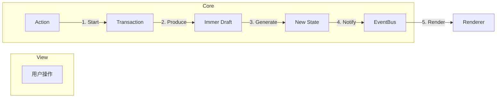

我明白了，您希望在文档中补充更直观的**系统架构图**（展示模块关系）和**关键业务流程图**（展示数据流转）。

基于当前的 Monorepo 结构和不可变数据设计，我计划在 `ARCHITECTURE.md` 中增加以下图表：

### 1. 更新全局系统架构图 (Global Architecture)
*   **位置**: 第 3 章节。
*   **内容**: 更新原有的架构图，使其与新的 Monorepo 结构对齐。明确区分 `@lowcode/core`（纯逻辑）、`@lowcode/designer`（交互层）和 `renderer-*`（渲染层）的边界与依赖关系。

### 2. 新增核心内部架构图 (Core Internal Architecture)
*   **位置**: 第 4 章节（核心模块设计）或单独新节。
*   **内容**: 深入 `@lowcode/core` 内部，展示 `Kernel` (Engine/Model)、`Drivers` (Input)、`EventBus` 和 `State` (Immer) 之间的静态结构关系。

### 3. 新增关键流程图 (Key Process Flows)
*   **位置**: 新增第 8 章节“核心流程图解”。
*   **内容**:
    *   **单向数据流 (Unidirectional Data Flow)**: 展示 `Action` -> `Transaction` -> `Immer Draft` -> `New State` -> `Notify` 的完整闭环。
    *   **交互更新流程 (Interaction Flow)**: 以“拖拽节点”为例，展示从 `Designer` 捕获事件 -> `Core` 计算位置 -> `Model` 更新 -> `Renderer` 重绘的全过程。

### Mermaid 示例预览

**数据流架构图：**

我将更新 `ARCHITECTURE.md`，嵌入这些 Mermaid 图表。
