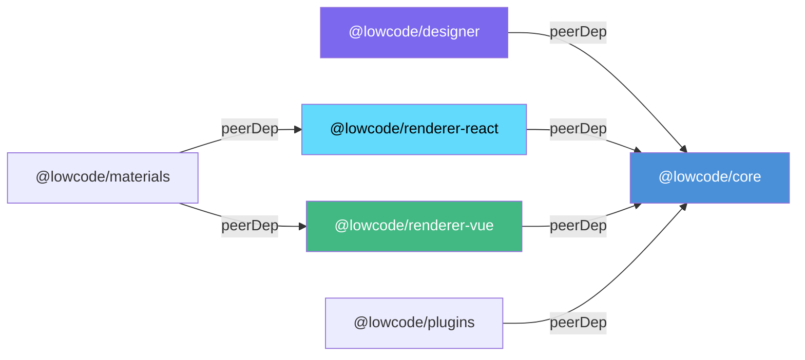
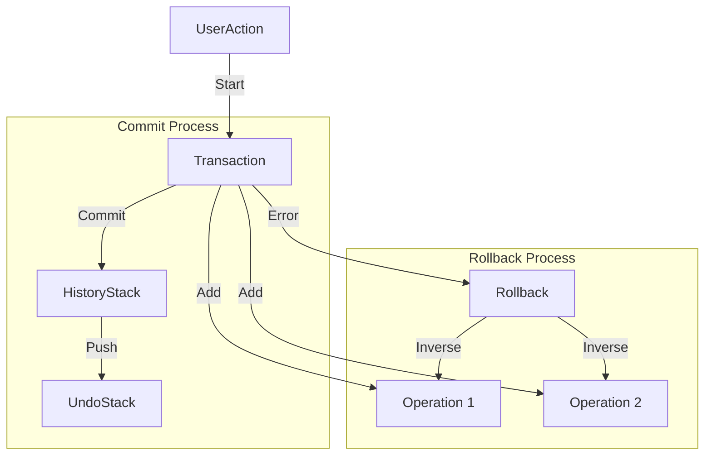
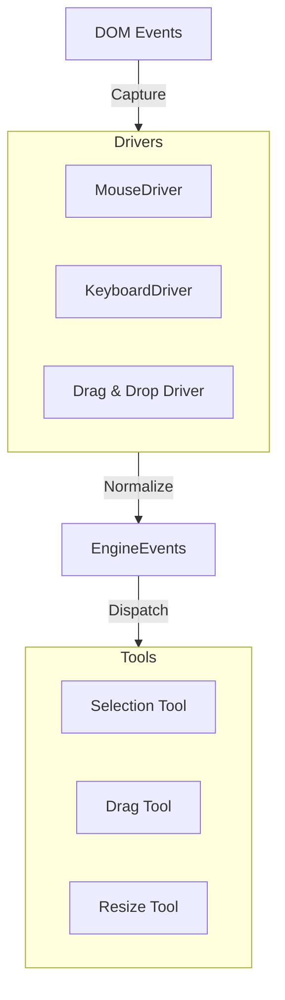
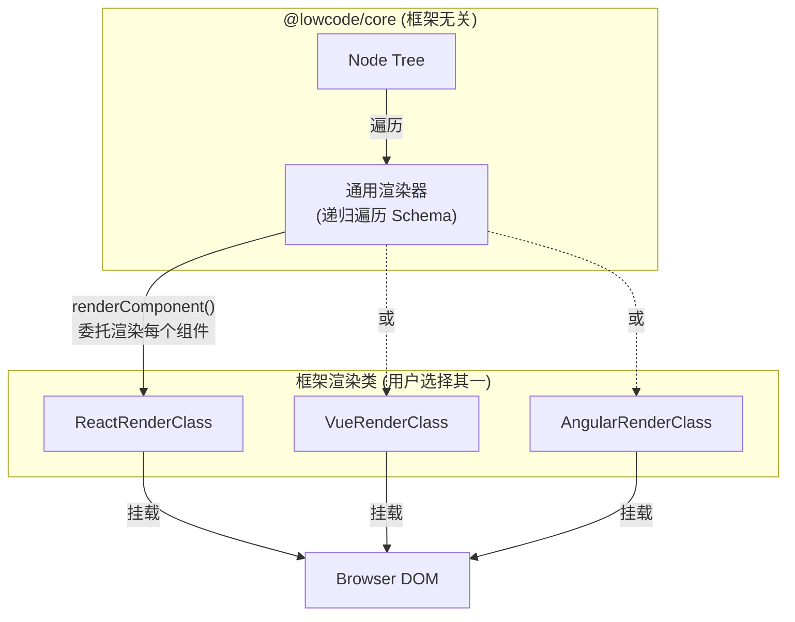
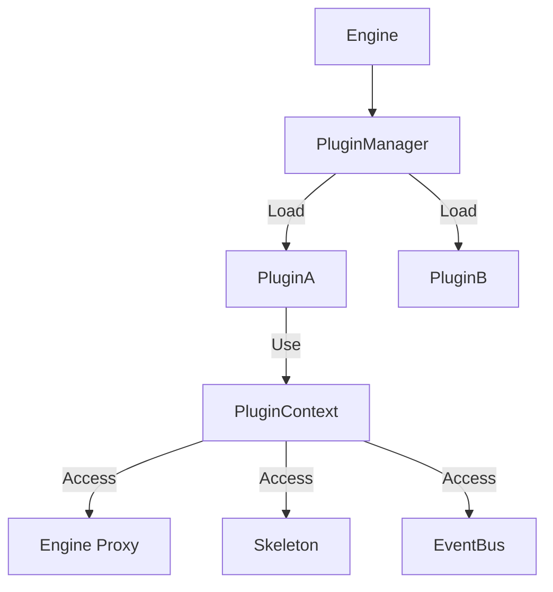
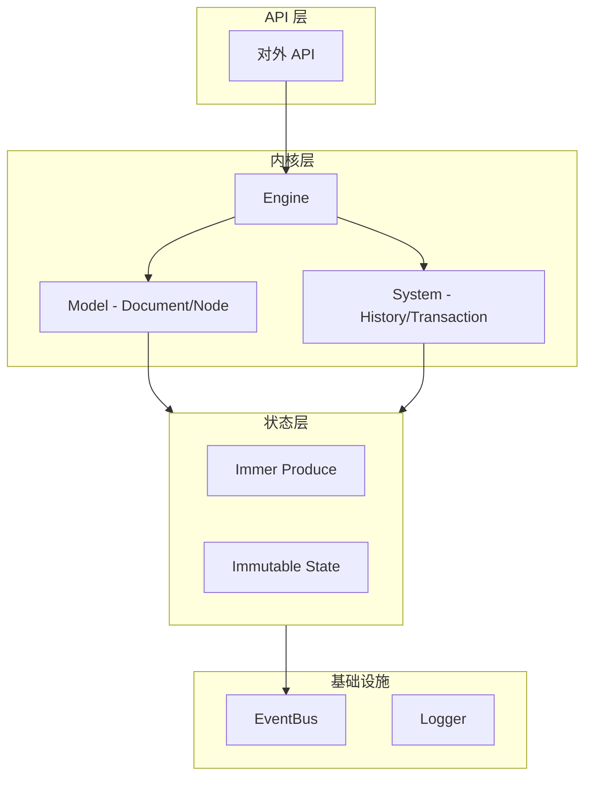
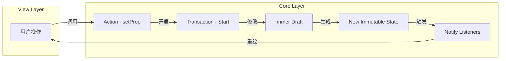
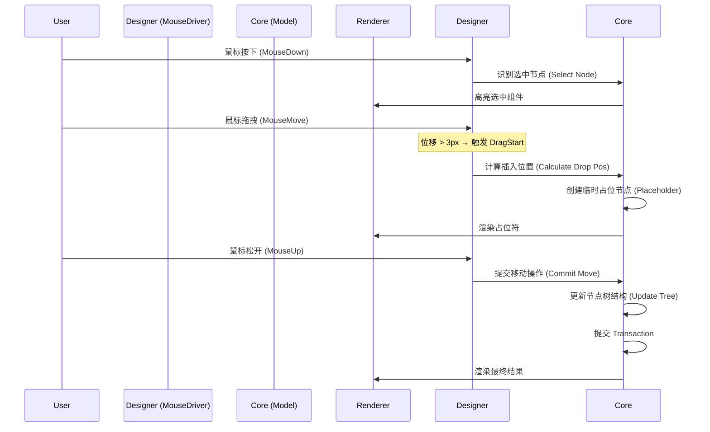
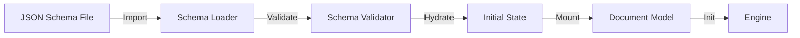
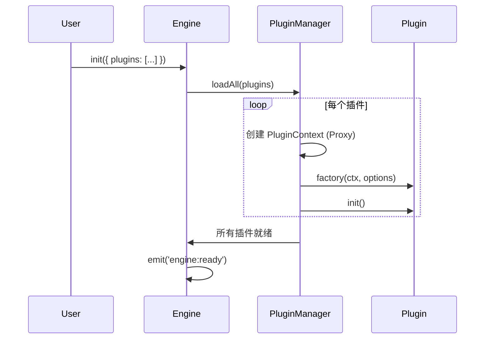

# 低代码编辑器核心库架构文档

## 1. 项目概述 (Overview)

本项目是一个纯 JavaScript 编写的低代码编辑器核心库（Core），旨在提供一套与 UI 框架无关（Framework Agnostic）的编辑器底层能力。它负责管理页面节点树（Node Tree）、处理用户交互、管理历史记录以及提供插件扩展机制。

**核心设计理念：**
*   **框架无关 (Framework Agnostic)**: 核心逻辑不绑定 React/Vue/Angular，通过**渲染适配器 (Renderer Adapter)** 对接不同框架。
*   **模型驱动视图 (Model Driven View)**: UI 状态由底层数据模型驱动。
*   **内外分离 (Functional Core, OOP Shell)**: 内部逻辑处理以**函数式编程**为主（纯函数、不可变数据），对外暴露 API 以 **Class (OOP)** 为主（易于理解的状态封装）。
*   **双模态 (Dual Mode)**: 明确区分**编辑态 (Edit Mode)**与**运行态 (Runtime Mode)**，共享核心渲染逻辑。

## 2. 术语表 (Glossary)

| 术语 | 说明 |
| :--- | :--- |
| **Engine** | 引擎单例，全局唯一入口，管理 Document 生命周期、插件注册、全局配置。 |
| **Workspace** | 工作区，负责多标签页（多 Document）切换管理。 |
| **Document** | 对应一个页面或一个组件配置，是 Node Tree 的根容器。 |
| **Node** | 组件节点，描述组件实例的最小单元，包含 props、children、events 等信息。 |
| **Schema** | 序列化后的 JSON 数据，与内存中的 Node Tree 保持结构一致。 |
| **Material** | 物料/组件，是低代码编辑器的基本单元，遵循统一的协议规范。 |
| **Skeleton** | UI 骨架模型，定义编辑器界面的各个区域（TopBar, SideBar, StatusBar 等），插件通过它注册 UI 面板。 |
| **Transaction** | 事务，一组操作的集合，具有原子性（Atomicity），失败时可整体回滚。 |
| **Operation (Op)** | 最小粒度的修改指令，如 `setProp`、`insertNode`、`removeNode`。 |
| **Driver** | 输入驱动，将浏览器原始 DOM 事件（MouseDown/Move/Up）转化为语义化的编辑器事件（DragStart/Dragging/Drop）。 |
| **LayoutStrategy** | 布局策略，定义容器节点如何排列子节点（Flow/Grid/Free）。 |
| **Renderer** | 通用渲染器，递归遍历 Node Tree 并委托框架渲染类将每个组件挂载到页面。 |
| **NodeWrapper** | 编辑态包装器，在编辑模式下包裹业务组件以拦截交互、注入事件、显示辅助 UI。 |
| **Hydration** | 注水流程，将 JSON Schema 加载为内存中的 Node Tree 实例。 |
| **PluginContext (Ctx)** | 插件运行时上下文，暴露给插件的受限 API 集合。 |

## 3. 功能列表 (Feature List)

*   **画布管理**: 节点的增删改查、拖拽排序、自由布局/流式布局切换。
*   **组件加载**: 支持 Vue、React 等多框架组件的动态加载与渲染。
*   **历史记录**: 完善的 Undo/Redo 机制，支持 Group Undo、快照跳转。
*   **属性编辑**: 节点属性配置与联动（支持表达式绑定和主动响应）。
*   **布局系统**: 内置流式 (Flow)、网格 (Grid)、自由 (Free) 布局，支持自定义布局策略扩展和布局嵌套。
*   **多视图管理**: 单实例编辑器支持多标签页切换（自动卸载/重载资源）。
*   **插件系统**: 灵活的插件架构，支持插件间通信、依赖管理和安全隔离。
*   **基础设施**: 内置日志记录、错误边界处理、性能监控。

## 4. 系统架构 (System Architecture)

系统采用严格的分层架构设计，自下而上分为：**基础设施层**、**内核层**、**适配层**、**生态层**。

```mermaid
graph TD
    subgraph Infrastructure [基础设施层]
        Logger[日志系统]
        ErrorManager[错误处理]
        PerfMonitor[性能监控]
    end

    subgraph Core [@lowcode/core]
        Engine[引擎单例]
        Model[数据模型]
        State[Immer 状态]
        Drivers[输入驱动]
        Renderer[通用渲染器]
    end

    subgraph Designer [@lowcode/designer]
        Canvas[画布容器]
        Tools[交互工具]
        Simulator[模拟器]
    end

    subgraph Adapters [框架适配器]
        ReactAdapter[React 渲染类]
        VueAdapter[Vue 渲染类]
    end

    subgraph Ecosystem [生态层]
        Plugins[插件系统]
        Materials[物料组件库]
    end

    Infrastructure --> Core
    Core --> Adapters
    Designer -.->|操作| Core
    Adapters -.->|渲染| Designer
    Adapters --> Ecosystem
```

### 4.1 分层说明

1.  **基础设施层 (Infrastructure)**: 提供通用的日志、报错捕获、性能打点能力，不涉及具体业务。
2.  **内核层 (Kernel)**: 核心业务逻辑，包含模型定义、状态管理、布局计算。该层**不依赖任何 UI 框架**。
3.  **适配层 (Adapter)**: 提供不同 UI 框架（React/Vue）的渲染类实现，供内核的通用渲染器在递归渲染每个组件时调用。
4.  **生态层 (Ecosystem)**: 基于核心库扩展的具体业务功能，如特定的属性面板、快捷键插件、组件库等。

### 4.2 包依赖关系 (Package Dependencies)

各 Monorepo 子包之间的依赖关系如下：



> **原则**: `core` 不依赖任何其他包；`designer` 和 `renderer-*` 以 `peerDependency` 依赖 `core`；`materials` 依赖具体的 renderer。

## 5. 核心模块设计 (Core Modules)

### 5.1 引擎与生命周期 (Engine & Lifecycle)

编辑器核心采用**单实例 (Singleton)** 模式。在多标签页场景下，Engine 实例保持不变，通过切换 `Document` 和卸载/挂载视图来实现。

*   **Engine**: 全局唯一的入口，管理 Document 生命周期、插件注册、全局配置。
*   **Workspace**: 工作区管理，负责多标签页的切换逻辑。

**多标签切换流程：**
1.  用户点击标签 B。
2.  Engine 触发 `unmount` 事件 -> 销毁当前画布组件，清理 DOM 事件，释放内存。
3.  Engine 切换 `currentDocument` 指向 B。
4.  Engine 触发 `mount` 事件 -> 加载 B 文档对应的组件资源，初始化通用渲染器。

### 5.2 模型层 (Model Layer)

模型层专注于描述页面结构，采用 **不可变数据 (Immutable Data)** 设计。

*   **Document**: 对应一个页面或组件配置。它是模型树的根。
*   **Node**: 组件节点。内部状态必须通过 `immer` 产生的 Draft 修改。
*   **TransactionManager**: 事务管理器，确保操作的原子性。支持自动回滚。

#### 5.2.1 Node Schema 协议

Node 的 Schema 采用统一的 TypeScript 接口定义，描述组件实例的完整数据结构：

```typescript
interface NodeSchema {
  id: string;              // 节点唯一标识
  componentName: string;   // 组件名称，如 "Button"
  props: PropItem[];       // 属性列表
  children?: NodeSchema[]; // 子节点
  events?: EventItem[];    // 事件绑定列表
  condition?: boolean;     // 是否渲染
  loop?: any[];            // 循环渲染数据源
  meta?: Record<string, any>; // 扩展元数据
}

/**
 * 属性值定义 - 支持多种动态类型
 */
type PropValue =
  | string | number | boolean             // 原始类型
  | { type: 'JSExpression'; value: string } // 表达式绑定
  | { type: 'JSFunction'; value: string }   // 内联函数
  | object;                                 // 对象/数组

/**
 * 属性项定义
 */
interface PropItem {
  name: string;     // 属性名，支持路径如 "style.width"
  value: PropValue; // 属性值
  type?: string;    // 值类型提示 (可选)
}

/**
 * 事件项定义
 */
interface EventItem {
  name: string;           // 事件名，如 "onClick"
  handler: EventHandler;  // 事件处理器
}

interface EventHandler {
  type: 'JSFunction' | 'ActionRef'; // 内联函数或引用 Action
  value: string;                     // 函数体或 Action ID
}
```

#### 5.2.2 属性联动 (Property Reactions)

Node 的属性之间可以建立联动关系，支持两种模式：

1.  **被动表达式 (Passive Expressions)**
    通过 `JSExpression` 类型的值实现，属性值根据表达式动态计算。
    ```javascript
    // props 示例
    [
      { name: "visible", value: { type: "JSExpression", value: "props.type === 'primary'" } }
    ]
    ```

2.  **主动响应 (Active Reactions)**
    在 `meta` 或单独的配置中定义副作用，监听源属性变化并修改目标属性。
    *(注：复杂联动建议封装在自定义组件内部，Schema 层主要处理简单的 UI 状态流转)*

#### 5.2.3 状态更新模式

1.  **Action**: 外部调用方法（如 `node.setProp`）。
2.  **Produce**: 使用 `immer` 基于当前 State 生成 Next State。
3.  **Notify**: 仅当 State 引用变化时，触发更新事件。

```javascript
import { produce } from 'immer';

// 对外暴露 Class
class Node {
    constructor(data) {
        this._state = Object.freeze(data); // 初始状态冻结
    }
    
    // 外部调用
    setProp(key, value) {
        const nextState = produce(this._state, draft => {
            draft.props[key] = value;
        });
        
        // 引用相等性检查：如果没有变化，不触发任何逻辑
        if (nextState === this._state) return;
        
        const transaction = engine.transaction.current || engine.transaction.start('auto-prop-change');
        try {
            const oldState = this._state;
            this._state = nextState;
            
            this.emit('change', { prev: oldState, next: nextState });
            transaction.commit();
        } catch (e) {
            transaction.rollback();
            throw e;
        }
    }
}
```

### 5.3 协议与持久化 (Schema & Persistence)

负责 JSON Schema 的加载与验证。由于**内存模型 (State) 与 Schema 结构保持 1:1 实时同步**，因此不需要复杂的序列化器 (Serializer)。

*   **Loader (Import)**: 负责 Schema 的校验与初始状态装载。
*   **Export**: 直接返回当前的 State 树即可 (`JSON.stringify(rootNode.state)`)。
*   **Validator**: 校验 Schema 的合法性。

### 5.4 事务与历史记录 (Transaction & History)

在基础 Undo/Redo 之上，引入更高级的回滚机制，确保复杂操作（如拖拽涉及选中、移动、更新父节点）的原子性。

#### 5.4.1 核心概念

*   **Transaction**: 一组操作的集合，具有原子性（Atomicity）。
*   **Operation (Op)**: 最小粒度的修改指令。利用 `immer` 的 `patches` 和 `inversePatches` 特性自动生成。
*   **HistoryStack**: 存储已提交事务的栈结构（UndoStack / RedoStack）。
*   **Snapshot**: 文档在某时刻的完整状态副本。



#### 5.4.2 自动事务 vs 显式事务

*   **自动事务 (Auto Transaction)**: 若用户直接调用 `node.setProp` 而未显式开启事务，系统自动创建一个"单操作事务"并立即提交。
*   **显式事务 (Explicit Transaction)**: 用于将多步操作合并为一次撤销。

```javascript
// 显式事务（多步操作合为一次撤销）
engine.transaction.start('drag-move');
try {
    nodeA.setProp('x', 100);
    nodeB.setProp('y', 200);
    engine.transaction.commit();
} catch (e) {
    engine.transaction.rollback();
}

// 链式操作简写
engine.transaction.run(() => {
    node.setProp('width', 100);
    node.setProp('height', 200);
});
```

#### 5.4.3 撤销/重做流程

1.  用户点击 Undo。
2.  HistoryManager 从 `UndoStack` 弹出最近一个 Transaction。
3.  遍历 Transaction 中的 `ops`（倒序），对每个 op 执行逆向操作（apply inverse patch）。
4.  将该 Transaction 推入 `RedoStack`。
5.  触发 `history:change` 事件。

**注意**: Undo/Redo 后再次写入操作时，自动清空 `RedoStack`。

#### 5.4.4 性能优化

*   **快照压缩**: 不存储每次的全量 JSON。仅存储 `Initial State` + `Patches`。当 Patches 数量超过阈值（如 50）时，生成新的 Baseline Snapshot，丢弃旧 Patches。
*   **操作节流 (Throttling)**: 对于高频操作（如 `mousemove` 触发的 `setProp`），在 `drag` 过程中不提交事务只更新视图，在 `dragEnd` 时提交一次最终事务。
*   **Group Undo**: 支持将多次小操作合并为一次撤销单元。

#### 5.4.5 快照与回滚

1.  `engine.snapshot.create('v1.0')` -> 序列化当前 Document -> 存入快照列表。
2.  用户进行一系列误操作。
3.  `engine.snapshot.restore('v1.0')` -> 读取快照 -> 反序列化 -> 替换当前 Document -> 触发全量重绘。
4.  `engine.history.goto(stateIndex)` -> 跳转到任意历史位置。

### 5.5 事件系统 (Event System)

编辑器涉及大量模块间的通信（Core, Designer, Renderer, Plugins）。通过中心化的事件总线解耦模块。

#### 5.5.1 事件命名规范

采用 `Resource:Action` 格式，全部小写：

```
engine:init, engine:mount, engine:ready
node:add, node:remove, node:change
selection:change
history:undo, history:redo, history:change
cursor:drag
```

#### 5.5.2 通配符监听

支持通配符，方便插件批量监听一类事件：

*   `*` 匹配一级，如 `node:*` 匹配 `node:add`、`node:remove`、`node:change`。
*   `**` 匹配多级（可选扩展）。

```javascript
// 精确监听
engine.events.on('node:add', ({ node }) => {
    console.log('Added:', node.id);
});

// 通配符监听
engine.events.on('node:*', (payload) => {
    console.log('Node operation:', payload);
});
```

#### 5.5.3 接口定义

```typescript
type EventHandler<T = any> = (event: T) => void;

interface IEventBus {
    on<T>(event: string, handler: EventHandler<T>): () => void; // 返回取消函数
    once<T>(event: string, handler: EventHandler<T>): void;
    off(event: string, handler: EventHandler): void;
    emit(event: string, payload?: any): void;
}
```

#### 5.5.4 事件派发流程

1.  模块 A 调用 `emit('node:change', { id: 1 })`。
2.  EventBus 查找精确匹配 `node:change` 的监听器列表。
3.  EventBus 查找通配符匹配 `node:*` 的监听器列表。
4.  依次同步执行监听器回调。
5.  如果任一监听器抛出异常，EventBus 捕获并记录 Error Log，**不阻断后续监听器执行**。

#### 5.5.5 性能与边界

*   **同步 vs 异步**: 核心事件（如数据变更）必须是**同步**的，以保证 UI 渲染的一致性。部分非关键事件（如埋点上报）可以是异步的。
*   **循环调用防护**: 需要防范 `A -> emit -> B -> emit -> A` 的死循环。通过 `Transaction` 锁或调用栈深度限制来解决。

#### 5.5.6 核心事件清单

| 事件名 | 说明 | 参数示例 |
| :--- | :--- | :--- |
| `engine:init` | 引擎初始化完成 | `{ config: Object }` |
| `engine:mount` | 引擎挂载完成 | `{ root: Node }` |
| `engine:ready` | 所有插件加载完成 | `{}` |
| `node:add` | 节点添加 | `{ node: Node, parent: Node, index: number }` |
| `node:remove` | 节点移除 | `{ node: Node, parent: Node }` |
| `node:change` | 节点属性变更 | `{ node: Node, key: string, value: any }` |
| `selection:change` | 选区变化 | `{ selectedIds: string[] }` |
| `history:undo` | 执行了撤销 | `{ transaction: Transaction }` |
| `history:redo` | 执行了重做 | `{ transaction: Transaction }` |
| `history:change` | 历史记录栈变化 | `{ undoLength: number, redoLength: number }` |
| `cursor:drag` | 拖拽进行中 | `{ x: number, y: number, dragNode: Node }` |

### 5.6 交互驱动系统 (Interaction Drivers)

编辑器中充满了复杂的交互（拖拽组件、调整大小、框选节点等）。交互驱动层将 DOM 事件转化为语义化的编辑器事件，屏蔽浏览器差异，统一输入源。

#### 5.6.1 驱动架构



#### 5.6.2 核心驱动

*   **MouseDriver**: 监听全局鼠标事件，计算 `cursor`（当前位置）、`delta`（移动距离）、`target`（hover 的节点 ID）。
*   **KeyboardDriver**: 监听全局键盘事件，处理快捷键组合（`Command+S`、`Ctrl+C`），支持优先级抢占（Input 焦点时屏蔽快捷键）。
*   **DragDropDriver**: 基于 MouseDriver 的高级驱动，内置状态机：`Idle` -> `DragStart`（阈值 3px 检测）-> `Dragging` -> `Drop` -> `Idle`。负责渲染 Ghost（拖拽幽灵节点）。

#### 5.6.3 交互状态机

编辑器在任一时刻只能处于一种主要交互模式，以避免冲突：

| 模式 | 说明 | 行为 |
| :--- | :--- | :--- |
| **Default** | 默认模式 | 响应 Hover、Click |
| **Dragging** | 拖拽模式 | 屏蔽 Hover，高亮 DropZone |
| **Resizing** | 缩放模式 | 锁定选中节点 |
| **Panning** | 画布漫游模式 | 按住 Space |

#### 5.6.4 拖拽策略

不同业务场景对应不同的拖拽策略：

**A. 画布内拖拽 (Sort/Move)**
*   同一容器内调整位置。
*   **Sortable Flow**: 鼠标越过节点中线时交换占位符位置。
*   **Free Move**: 直接更新占位符的 `x, y`。

**B. 跨容器拖拽 (Cross-Container)**
*   将组件从容器 A 拖入容器 B。
*   事务操作：`sourceParent.removeChild(node)` -> `targetParent.insertChild(node, index)`。

**C. 从物料库拖入 (Insert from Material)**
*   从左侧组件库拖入画布。
*   携带物料元数据 (Schema)，Drop 时根据 Schema 创建新 `Node` 实例并插入。

#### 5.6.5 占位符机制 (Placeholder)

拖拽过程中**不直接修改 DOM 树结构**，而是使用视觉占位符：

*   **Line Placeholder**: 一条线，用于 Flow 布局，指示插入缝隙。
*   **Box Placeholder**: 虚线框，用于 Grid/Free 布局，指示占据空间。

### 5.7 布局引擎 (Layout Engine)

为了支持多种布局模式及未来扩展，布局计算逻辑从 Node 中剥离，采用**策略模式**。每个容器节点可以独立配置自己的布局策略。

#### 5.7.1 布局策略接口

```typescript
interface LayoutStrategy {
  name: string; // 'flow' | 'grid' | 'free'
  
  /**
   * 当前模式下是否允许用户拖拽
   * @param mode 当前模式 ('edit' | 'runtime')
   */
  isDraggable(mode: 'edit' | 'runtime'): boolean;
  
  /**
   * 拖拽进入时的位置计算
   * @returns 插入索引或坐标
   */
  getDropPosition(container: Node, dragNode: Node, cursor: Point): DropPosition;
  
  /**
   * 渲染时的样式生成
   */
  getNodeStyle(node: Node): CSSProperties;
}
```

#### 5.7.2 内置布局模式

| 布局 | 说明 | Drop 计算 | 实现方式 | 运行态拖拽 | 典型场景 |
| :--- | :--- | :--- | :--- | :--- | :--- |
| **FlowLayout** | 流式，按文档流排列 | 返回 `{ index: N }` | CSS Flexbox/Block | ❌ 禁用 | 表单、列表 |
| **GridLayout** | 网格，N 列栅格系统 | 返回 `{ x, y, w, h }` 吸附网格线 | CSS Grid | ✅ 启用 | Dashboard、大屏 |
| **FreeLayout** | 自由，绝对定位 | 返回 `{ x, y }` | `position: absolute` | ❌ 禁用 | 营销海报、PPT |

**注册自定义布局：**
```javascript
engine.layout.register('custom-circle', new CircleLayoutStrategy());
```

#### 5.7.3 布局嵌套

不同布局策略可以嵌套使用，通用渲染器递归时根据当前节点的布局配置加载对应的 `LayoutStrategy`：

```
Root (Flow)
  └── Section (Grid)
        ├── Card (Flow)
        │     └── Button
        └── Card (Flow)
```

#### 5.7.4 编辑态与运行态的布局行为

不同布局模式在编辑态 (Edit) 和运行态 (Runtime) 下的拖拽行为有显著差异：

| 布局模式 | 编辑态 | 运行态 | 设计动机 |
| :--- | :--- | :--- | :--- |
| **Flow** | ✅ 可拖拽排序 / 跨容器移动 | ❌ 静态渲染 | 排版由开发者预设，终端用户无需调整 |
| **Free** | ✅ 可自由拖拽 / Resize | ❌ 静态渲染 | 定位由设计者决定，运行时固定 |
| **Grid** | ✅ 按栅格吸附拖拽 | ✅ 按栅格吸附拖拽 | Dashboard 场景需终端用户自行编排卡片 |

布局策略通过 `isDraggable(mode)` 方法控制：Flow/Free 仅在 `edit` 模式返回 `true`，Grid 在两种模式下均返回 `true`。

> Grid 运行态的布局调整结果应持久化到用户维度的配置中，与设计态的 Schema 数据分离存储。

#### 5.7.5 Grid 布局详细设计

##### 栅格配置

```typescript
interface GridConfig {
  colCount: number;     // 列数 (如 12)
  rowHeight: number;    // 单行高度 (px)
  gap: [number, number]; // 栅格间距 [水平, 垂直] (px)
  margin: [number, number]; // 容器内边距 [水平, 垂直] (px)
  compactMode: 'vertical' | 'horizontal' | 'none'; // 压缩方向
}

interface GridItemLayout {
  x: number; y: number; // 栅格坐标 (0-indexed)
  w: number; h: number; // 占据栅格数
}
```

##### 吸附逻辑 (Snap-to-Grid)

拖拽时像素坐标折算为栅格坐标并取整：

```
cellWidth = (containerWidth - margin[0]*2 - gap[0]*(colCount-1)) / colCount
snapX = Math.round((cursorX - margin[0]) / (cellWidth + gap[0]))
snapY = Math.round((cursorY - margin[1]) / (rowHeight + gap[1]))
```

##### 挤压算法 (Compaction & Collision)

当组件放置或移动时，通过三步算法确定最终位置：

1.  **碰撞检测**: 判断目标位置是否与已有组件的矩形区域重叠（AABB 检测）。
2.  **下推 (Pushdown)**: 将被碰撞组件向下推移至移动组件正下方，递归处理级联碰撞。
3.  **向上压缩 (Compact Up)**: 按 `y` 坐标从小到大排序，逐个尝试上移到最高可用位置，消除空隙。

> 详细算法实现参见 [006-layout-system.md](file:///Users/xuyixin/Desktop/core/docs/design/006-layout-system.md) §2.6。

### 5.8 渲染适配器 (Renderer Adapter)

核心库（`@lowcode/core`）内置了一个**通用渲染器 (Universal Renderer)**，它负责递归遍历 JSON Schema（Node Tree），处理条件渲染、循环渲染、属性计算等通用逻辑。在渲染到每个具体组件时，通用渲染器将**委托给框架渲染类（Framework Render Class）**，由该渲染类使用对应框架（React / Vue / Angular）的 API 将组件挂载到页面中。

> **核心原则**: 通用渲染器本身是框架无关的纯 JavaScript 实现，它不关心具体用哪种框架渲染组件。框架渲染类（如 `ReactRenderClass`、`VueRenderClass`）只需要实现一个简单的 `renderComponent` 接口，告诉通用渲染器"如何用该框架把一个组件挂载到一个 DOM 容器上"。一个编辑器实例只使用**一种**框架渲染类。

#### 5.8.1 架构设计



渲染职责分为两层：

1.  **通用渲染器 (Universal Renderer)**：位于 `@lowcode/core` 中，负责递归遍历 Node Tree、计算属性（解析 `JSExpression`）、处理 `condition` / `loop` 逻辑、创建 DOM 容器、编排子节点挂载顺序。它是框架无关的纯 JavaScript 实现。
2.  **框架渲染类 (Framework Render Class)**：由各适配器包（`@lowcode/renderer-react`、`@lowcode/renderer-vue`）提供，只实现**单个组件的挂载逻辑**——即如何用特定框架的 API 把一个组件渲染到给定的 DOM 容器中。

#### 5.8.2 框架渲染类接口定义

所有框架渲染类必须实现统一的 `FrameworkRenderClass` 接口。核心职责只有一个：**将单个组件挂载到指定的 DOM 容器**。

```typescript
interface FrameworkRenderClass {
    /** 
     * 将一个组件渲染/挂载到指定的 DOM 容器中
     * 由通用渲染器在递归遍历每个节点时调用
     */
    renderComponent(options: {
        componentName: string;     // 组件名称
        props: Record<string, any>; // 已解析的属性
        container: HTMLElement;     // 挂载目标 DOM 容器
        node: Node;                 // 当前节点实例
        mode: 'edit' | 'runtime';  // 渲染模式
    }): void;
    
    /** 更新已挂载组件的属性 */
    updateComponent(nodeId: string, props: Record<string, any>): void;
    
    /** 销毁已挂载的单个组件，清理资源 */
    destroyComponent(nodeId: string): void;
    
    /** 注册业务组件（组件实现需与框架对应） */
    registerComponent(name: string, component: any): void;
}
```

#### 5.8.3 使用方式

用户在初始化时选择框架渲染类，注入到核心的通用渲染器中：

```javascript
import { Engine } from '@lowcode/core';
import { ReactRenderClass } from '@lowcode/renderer-react';
// 或 import { VueRenderClass } from '@lowcode/renderer-vue';

const engine = new Engine({
    // 选择框架渲染类，通用渲染器会在递归渲染时调用它
    renderClass: new ReactRenderClass(),
    plugins: [/* ... */],
});

// 注册的业务组件需与所选框架渲染类匹配
// 例如选择了 React 渲染类，则注册 React 组件
engine.components.register('Button', MyReactButton);
```

#### 5.8.4 Schema Hydration (注水流程)

这是 "JSON Schema 渲染成树" 的第一步，发生在 `engine.workspace.open(schema)` 阶段（此过程在 Core 层完成，与渲染器无关）：

1.  **Traversal**: 深度优先遍历 JSON Schema。
2.  **Instantiation**: 为每个节点创建 `Node` 实例（生成唯一 `id`，建立 `parent` 指针，初始化运行时状态）。
3.  **Indexing**: 将所有节点存入 `doc.nodes` Map，方便 O(1) 查找。

#### 5.8.5 通用渲染器的递归渲染流程

通用渲染器的**核心逻辑由纯 JavaScript 实现**，位于 `@lowcode/core` 中。它递归遍历 Node Tree，处理属性计算、条件渲染等通用逻辑，对每个节点调用框架渲染类的 `renderComponent` 方法，由渲染类决定如何用具体框架创建并挂载组件。

```javascript
/**
 * 通用渲染器核心逻辑 (纯 JS，框架无关)
 * 递归遍历节点树，委托框架渲染类渲染每个组件
 */
function renderNode(node, renderClass, mode) {
  // 1. 计算属性（转换 JSExpression 等动态值）
  const resolvedProps = computeProps(node.props);
  
  // 2. 为当前节点创建 DOM 容器
  const container = document.createElement('div');
  container.setAttribute('data-node-id', node.id);
  
  // 3. 委托框架渲染类：渲染组件到容器
  //    渲染类内部决定用 React / Vue / Angular 的方式挂载
  renderClass.renderComponent({
    componentName: node.componentName,
    props: resolvedProps,
    container,
    node,
    mode,           // 'edit' | 'runtime'
  });
  
  // 4. 递归渲染子节点，挂载到当前容器
  (node.children || []).forEach(child => {
    const childEl = renderNode(child, renderer, mode);
    container.appendChild(childEl);
  });
  
  return container;
}

// 通用渲染器入口
function render(document, renderClass, rootContainer, mode) {
  const tree = renderNode(document.rootNode, renderClass, mode);
  rootContainer.appendChild(tree);
}
```

各框架渲染类的 `renderComponent` 实现示例：

```javascript
// ---- React 框架渲染类 ----
class ReactRenderClass {
  renderComponent({ componentName, props, container, node, mode }) {
    const Comp = this.registry.get(componentName);
    const element = React.createElement(Comp, props);
    
    // 编辑态包裹 Wrapper
    const wrapped = mode === 'edit'
      ? React.createElement(NodeWrapper, { node }, element)
      : element;
    
    ReactDOM.createRoot(container).render(wrapped);
  }
}

// ---- Vue 3 框架渲染类 ----
class VueRenderClass {
  renderComponent({ componentName, props, container, node, mode }) {
    const Comp = this.registry.get(componentName);
    
    // 通过 createApp 创建 Vue 应用实例并挂载到容器
    const app = createApp(Comp, props);
    app.mount(container);
    
    // 保存实例引用，用于后续更新和销毁
    this.instances.set(node.id, app);
  }
}
```

> **Vue 渲染策略**: Vue 渲染类可采用两种策略：
> 1.  **独立实例模式**: 每个组件节点都通过 `createApp()` 创建独立的 Vue 应用实例，实例之间通过 Core 的事件系统通信。隔离性好，适合组件间无强耦合的场景。
> 2.  **子组件模式**: 只创建一个根 `createApp()` 实例，所有节点组件作为该实例的子组件挂载。可利用 Vue 原生的父子通信和响应式系统，适合需要组件间共享上下文的场景。

#### 5.8.6 组件加载器 (Component Loader)

负责根据 `componentName` 找到具体的组件实现。注册的组件需与所选框架渲染类匹配。

*   **Registry**: 维护 `Map<string, ComponentClass>`。
*   **Async Load**: 支持远程组件（`import()`、`System.import`）。

```javascript
// 注册组件（组件实现需匹配所选框架渲染类）
engine.components.register('Button', MyButton);

// 渲染时查找（未找到则回退到默认占位符）
const Comp = engine.components.get('Button') || DefaultPlaceholder;
```

#### 5.8.7 编辑态包装器 (NodeWrapper)

在编辑模式下，所有组件被包裹一层 `NodeWrapper`（由各框架渲染类各自实现），职责包括：

*   **拦截交互**: 阻止业务组件内部的点击跳转（如 `<a>` 标签），改为"选中节点"。
*   **注入事件**: 绑定 `onMouseDown`，触发 `DragStart`。
*   **显示辅助**: 渲染 Hover 边框、Label 标签。
*   **Ref 转发**: 获取真实 DOM 节点，用于计算尺寸和位置。

#### 5.8.8 精准更新 (Fine-grained Update)

避免在 Root 层面监听所有变化导致全量重绘。每个渲染节点只订阅**当前 Node** 的变化：

```javascript
// React 渲染类示例
const NodeRenderer = ({ nodeId }) => {
  // 只订阅当前节点的变更
  const node = useNode(nodeId); 
  // ...
}
```

当 `node.setProp` 发生时，EventBus 触发 `node:change:${id}`，只有对应的渲染节点重绘。各框架渲染类利用框架自身的优化机制（React 的 `memo`、Vue 的响应式系统等）实现高效更新。

### 5.9 编辑态与运行态 (Modes)

*   **Edit Mode**: 加载 `Designer` 模块，启用拖拽、选中、Hover 效果。组件被包裹在 `NodeWrapper` 中以拦截交互。所有布局模式（Flow / Grid / Free）均支持拖拽。
*   **Runtime Mode**: 仅加载通用渲染器和 `Document` 数据，直接渲染组件，不包含任何编辑逻辑，保证高性能。**但 Grid 布局是例外**——运行态下仍保留拖拽能力，以支持终端用户自行编排 Dashboard 卡片（参见 §5.7.4）。

布局策略通过 `isDraggable(mode)` 方法声明自身在不同模式下的拖拽能力，通用渲染器和交互驱动层据此决定是否绑定拖拽事件。

### 5.10 插件系统 (Plugin System)

核心库通过插件机制实现能力扩展。编辑器核心能力保持精简，大量业务功能（快捷键、右键菜单、面板、历史记录）通过插件实现。

#### 5.10.1 核心概念

*   **Plugin**: 独立的逻辑单元，包含 `init` 和 `destroy` 方法。插件按工作模式可分为：
    *   **Auto-start**: 加载即工作（如自动保存、快捷键）。
    *   **API-driven**: 被动调用（如弹窗服务、导出工具）。
*   **PluginManager**: 负责插件的加载、初始化、卸载及依赖解析。
*   **PluginContext (Ctx)**: 插件运行时上下文，暴露给插件的受限 API 集合（**代理对象，非原始 Engine**）。



#### 5.10.2 插件接口

```typescript
interface PluginFactory {
  (ctx: PluginContext, options: any): PluginInstance;
}

interface PluginInstance {
  name: string;
  init(): void | Promise<void>;
  destroy(): void;
  exports?: any; // 暴露给其他插件调用的 API (API-driven 模式核心)
}

interface PluginContext {
  engine: Engine;
  events: EventBus;
  skeleton: Skeleton;
  hotkey: HotkeyManager;
  plugins: PluginManager; // 访问其他插件
}
```

#### 5.10.3 扩展点 (Extension Points)

插件可以通过 Context 访问以下能力：

| 扩展类型 | 说明 | 示例 |
| :--- | :--- | :--- |
| **UI 扩展** | 在 TopBar/SideBar/StatusBar 注册组件 | `ctx.skeleton.add({ area: 'topbar', content: MyButton })` |
| **事件监听** | 响应内核事件 | `ctx.events.on('node:add', ...)` |
| **交互拦截** | 注册自定义 Interaction Handler | `ctx.canvas.registerHandler(...)` |
| **快捷键** | 注册键盘快捷键 | `ctx.hotkey.bind('ctrl+z', ...)` |

#### 5.10.4 插件示例 (Auto-start)

```javascript
const MyPlugin = (ctx) => {
    return {
        name: 'my-plugin',
        init() {
            ctx.events.on('node:add', (node) => {
                console.log('Node added:', node.id);
            });
            ctx.hotkey.bind('command+s', () => ctx.engine.save());
        },
        destroy() {}
    };
};
```

#### 5.10.5 插件能力暴露与通信 (APIs & Communication)

**API 驱动型** 插件通过 `exports` 暴露能力，其他插件通过 `PluginManager` 获取调用：

```javascript
// Plugin B (API Provider)
return {
    name: 'history',
    exports: { 
        undo: () => { /* ... */ },
        redo: () => { /* ... */ }
    }
}

// Plugin A (Consumer)
const history = ctx.plugins.get('history');
history.undo();
```

```javascript
// Plugin B - 暴露能力
return {
    name: 'history',
    exports: { undo: () => { /* ... */ } }
}

// Plugin A - 调用其他插件
const history = ctx.plugins.get('history');
history.undo();
```

#### 5.10.6 插件加载流程

1.  用户配置 `plugins: [PluginA, [PluginB, { option: 1 }]]`。
2.  `Engine.init()` 启动 `PluginManager`。
3.  `PluginManager` 遍历插件列表，创建 `PluginContext`。
4.  依次调用插件的 `init()` 方法（若有异步初始化，需 `await`）。
5.  所有插件初始化完成后，Engine 发射 `engine:ready` 事件。

#### 5.10.7 安全隔离 (Security)

*   **API 管控**: 插件拿到的 `ctx` 是经过封装的**代理对象 (Proxy)**，而非原始 Engine 实例，防止插件随意修改内核私有属性。
*   **错误边界**: 插件 `init` 或回调报错时，由 `PluginManager` 捕获并隔离，防止崩坏主线程，其他插件和编辑器核心不受影响。

### 5.11 物料协议 (Material Protocol)

物料（组件）是低代码编辑器的基本单元，遵循统一的协议规范。

> **注意**: 为保持框架无关性，以下接口中组件类型使用通用的 `any`，具体类型由 Renderer Adapter 层确定。

```typescript
interface Material {
    componentName: string;       // 组件唯一名称 (e.g., "Button")
    title: string;               // 显示标题 (e.g., "按钮")
    icon?: any;                  // 图标
    component: any;              // 运行时组件实现 (框架无关)
    designer?: any;              // (可选) 设计态组件，用于覆盖运行时行为
    propsSchema: JSONSchema;     // 属性描述，用于生成属性面板
    behaviorRule?: {             // 交互规则
        droppable: boolean;      // 是否可放置子组件
        draggable: boolean;      // 是否可拖拽
    };
    snippets: Snippet[];         // 代码片段/预设配置
}
```

## 6. 基础设施 (Infrastructure)

### 6.1 日志 (Logger)

为确保跨模块、跨项目的日志统一管理，采用**全局单例 (Global Singleton)** 设计。

*   **设计文档**: [008-infra-logger.md](docs/design/008-infra-logger.md)
*   **特性**:
    *   **Registry Pattern**: 基于 `Symbol.for` 的全局注册表，确保即使在多版本包共存时也能获取唯一的配置实例。
    *   **Namespace**: 支持按模块（如 `Core`, `Renderer`, `Plugin:A`）创建 Logger 实例并独立控制 Level。
    *   **Pluggable**: 支持扩展适配器，将日志流向 Console、文件或云监控平台。

```typescript
const logger = LoggerFactory.getLogger('Core');
logger.info('Engine initialized');
```

### 6.2 错误处理 (Error Handling)

建立**分层错误处理机制**，确保编辑器的高可用性。

*   **设计文档**: [009-infra-error-handling.md](docs/design/009-infra-error-handling.md)
*   **CoreError / SystemError**: 内核级错误，自动上报并降级。
*   **UserError**: 用户操作错误（如参数非法），通过 UI 提示 (Toast)。
*   **RenderError**: 组件渲染崩溃，由 **ErrorBoundary** 捕获并显示占位符，不影响全局。

### 6.3 性能监控 (Performance)

建立**实时性能监控体系**，确保大文档编辑流畅。

*   **设计文档**: [010-infra-performance.md](docs/design/010-infra-performance.md)
*   **KPI 指标**:
    *   **TQI (Time to Interactive)**: 初始化耗时。
    *   **OpLat (Operation Latency)**: 操作响应延迟 (Target < 16ms)。
    *   **NodeCount**: 节点规模监控。
*   **工具链**: 内置 `Performance Observer` 采集长任务与内存泄漏。

## 7. 目录结构规范 (Directory Structure)

本项目采用 **Monorepo** 结构，按照功能职责进行分包管理。

> **状态说明**: ✅ 已实现 | 🚧 开发中 | 📋 已规划

### 7.1 Monorepo 工程全景

```bash
/
├── .github/                # CI/CD 流程配置 (Actions)
├── scripts/                # 构建、发布、测试脚本
├── docs/                   # 项目详细文档
│   └── design/             # 技术方案设计文档 (TDD)
├── examples/               # 演示与调试项目
│   ├── react-demo/         # React 集成示例
│   └── vue-demo/           # Vue 集成示例
├── packages/               # 源码包
│   ├── core/               # ✅ [核心] 数据模型、逻辑内核 (无 UI 依赖)
│   ├── designer/           # 📋 [交互] 画布交互、拖拽、辅助线 (DOM 相关)
│   ├── renderer-react/     # 📋 [适配] React 框架渲染类
│   ├── renderer-vue/       # 📋 [适配] Vue 框架渲染类
│   ├── materials/          # 📋 [生态] 官方基础物料库
│   └── plugins/            # 📋 [生态] 官方插件集 (如 History, Keyboard)
├── pnpm-workspace.yaml     # Workspace 配置文件
└── package.json            # 根目录依赖管理
```

### 7.2 @lowcode/core 内部结构

核心包 (`packages/core`) 负责维护数据模型与业务逻辑，**严格禁止包含任何 DOM 操作或 UI 框架代码**。

```bash
packages/core/src/
├── api/                    # 统一对外暴露的顶层 API (Facade)
├── kernel/                 # ✅ 领域内核 (Domain Kernel)
│   ├── model/              # 数据模型定义
│   │   ├── node.js         # 节点模型 (Node)
│   │   ├── document.js     # 文档模型 (Document)
│   │   ├── props.js        # 属性模型 (Props)
│   │   └── selection.js    # 选区模型 (Selection)
│   ├── system/             # 系统级服务
│   │   ├── engine.js       # 引擎单例 (Engine)
│   │   ├── history.js      # 历史记录 (Undo/Redo)
│   │   └── transaction.js  # 事务管理 (Transaction)
│   ├── codec/              # 协议处理 (Schema Loader/Validator)
│   └── state/              # 状态管理 (Immer Reducers)
├── drivers/                # 📋 输入驱动 (标准化事件)
│   ├── keyboard.js         # 快捷键驱动
│   ├── mouse.js            # 鼠标行为驱动
│   └── drag-drop.js        # 拖拽行为驱动
├── events/                 # ✅ 事件总线 (EventBus)
├── layout/                 # 📋 布局计算引擎 (Strategy Pattern)
├── plugin/                 # 📋 插件内核 (Plugin System)
├── infra/                  # 📋 基础设施
│   ├── logger.js           # 日志系统
│   └── env.js              # 环境检测
└── utils/                  # 纯函数工具库
```

### 7.3 @lowcode/designer 内部结构

设计器包 (`packages/designer`) 负责处理画布上的交互逻辑。

```bash
packages/designer/src/
├── canvas/                 # 画布渲染管理 (DOM 容器)
├── simulators/             # 模拟器 (PC, Mobile, Responsive)
├── tools/                  # 交互工具集
│   ├── selector.js         # 选择工具 (处理点击选中)
│   ├── dragger.js          # 拖拽工具 (处理节点移动)
│   └── resizer.js          # 缩放工具
└── viewport/               # 视口管理 (滚动, 缩放)
```

## 8. 核心流程图解 (Core Diagrams)

### 8.1 核心内部架构 (Core Internal Architecture)

`@lowcode/core` 是完全解耦的逻辑核心，其内部模块依赖关系如下：



### 8.2 单向数据流 (Unidirectional Data Flow)

所有的数据变更都必须遵循以下流转闭环，严禁直接修改 State。



### 8.3 交互更新流程 (Interaction Flow)

以"用户拖拽组件"为例，展示 Designer、Core 和 Renderer 的协作。



### 8.4 Schema 加载流程 (Schema Loading)

展示从 JSON 文件加载到编辑器内存模型的转换过程。



### 8.5 插件加载流程 (Plugin Loading)



## 9. 开发规范

1.  **函数式优先**: 涉及数据变更的逻辑，必须编写为纯函数，便于单元测试和状态回溯。
2.  **依赖注入**: 核心模块尽量不直接依赖具体实现，通过 Context 或构造函数注入，方便 Mock 和替换。
3.  **注释规范**: 所有导出的 API 必须包含说明、参数类型、返回值及使用示例。
4.  **事件命名**: 遵循 `Resource:Action` 格式，全部小写（如 `node:add`）。

## 10. 测试策略 (Testing Strategy)

为保证核心库的稳定性，采用金字塔测试策略。

*   **单元测试 (Unit Tests)**: 针对 Kernel 和 Utils，覆盖率目标 80%+。重点测试：
    *   `Node` 模型的增删改查及事件触发。
    *   `Immer` 新状态的引用隔离（不破坏旧引用）。
    *   `Document` 的 Schema 导入导出无损性。
    *   `Transaction` 回滚精确还原状态，嵌套事务处理。
    *   EventBus 通配符匹配、`off` 内存泄漏检查。
    *   各布局策略 `getDropPosition` 计算正确性。
    *   插件加载顺序、依赖解析、销毁逻辑。
    *   工具: `Vitest`
*   **集成测试 (Integration Tests)**: 针对 Engine 与各个模块的协作。例如：加载 Schema -> 修改属性 -> 撤销 -> 验证状态。
*   **E2E 测试 (End-to-End)**: 针对 Designer 交互，模拟用户拖拽、点击等真实操作。
    *   工具: `Cypress` / `Playwright`
*   **性能测试 (Performance Tests)**:
    *   构建 10,000 个节点的树，测试 `setProp` 耗时（目标 < 5ms）。
    *   渲染 5,000 个节点的树，测量首屏时间 (FCP) 和更新时间。
*   **模糊测试 (Fuzz Testing)**: 随机生成大量操作序列，验证 Undo/Redo 后最终状态的一致性。

## 11. 构建与发布 (Build & Deliver)

*   **产物格式**:
    *   `esm`: 供 Bundler (Webpack/Vite) 使用。
    *   `cjs`: 供 Node.js 服务端使用。
    *   `umd`: 供浏览器直接引入。
*   **版本管理**: 遵循 SemVer 规范。
*   **CI/CD**: 基于 GitHub Actions 实现自动测试与发布。
