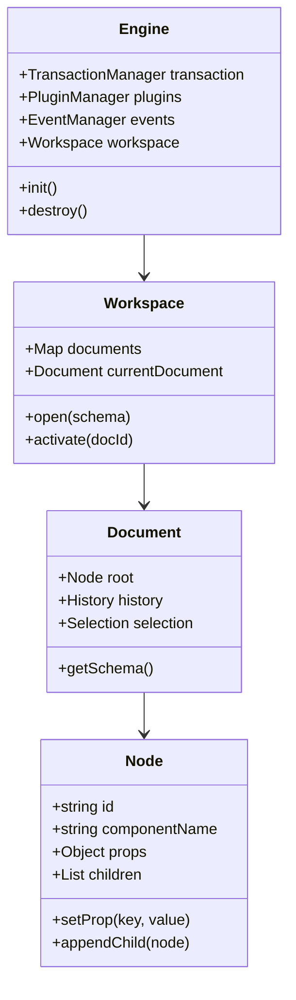
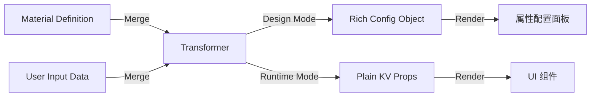

# 001 核心内核与数据模型设计 (Core Kernel & Data Model)

*   **Status**: Draft
*   **Author**: Core Team
*   **Created**: 2026-02-09

## 1. 背景与目标

### 1.1 背景
核心库目前缺乏统一的数据模型标准，且状态管理较为分散。为了支持复杂的撤销重做、协同编辑和跨框架渲染，我们需要一个稳健、不可变且高性能的内核模型。

### 1.2 目标
*   定义标准的 `Document` 和 `Node` 数据结构。
*   实现基于 `Immer` 的不可变状态管理，确保 `O(1)` 的变更检测性能。
*   设计 `Engine` 单例的生命周期管理，支持多文档切换。
*   确保模型层与 UI 框架完全解耦。

## 2. 详细设计

### 2.1 核心概念

*   **Engine**: 全局单例，编辑器的大脑，负责管理所有子模块（EventBus, PluginManager, Workspace）。
*   **Document**: 对应一个独立的页面或组件文件，是 Node Tree 的根容器。
*   **Node**: 描述组件实例的最小单元，包含 props, children 等信息。
*   **Schema**: 序列化后的 JSON 数据，与内存中的 Node Tree 保持结构一致。

### 2.2 架构设计



### 2.3 数据结构 (Data Structures)

#### Node Schema (JSON 协议)
```typescript
/**
 * 属性值类型定义
 * 支持静态值、JS 表达式、变量绑定
 */
type PropValue = 
  | string | number | boolean | null // 静态值
  | { type: 'JSExpression'; value: string } // 表达式，如 "state.count + 1"
  | { type: 'JSVariable'; value: string };  // 变量绑定，如 "state.user.name"

/**
 * 事件处理器定义
 */
interface EventHandler {
  type: 'JSFunction' | 'ActionRef'; // 内联函数或引用 Action
  value: string; // 函数体或 Action ID
}

/**
 * 属性项定义
 */
interface PropItem {
  name: string; // 属性名，如 "style.width"
  value: PropValue; // 属性值
  type?: string; // 值类型提示 (可选)
}

/**
 * 事件项定义
 */
interface EventItem {
  name: string; // 事件名，如 "onClick"
  handler: EventHandler; // 处理器
  modifiers?: string[]; // 修饰符，如 ["stop", "prevent"]
}

/**
 * 动画配置定义
 */
interface AnimationConfig {
  name: string; // 动画名，如 "fadeIn"
  duration: number; // 持续时间
  delay?: number; // 延迟
  easing?: string; // 缓动函数
}

interface NodeSchema {
  id: string;
  componentName: string; // 组件名，如 "Button"
  
  // 属性集合 (数组有序)
  props?: PropItem[]; 
  
  // 事件绑定 (数组有序)
  events?: EventItem[];
  
  // 动画配置 (数组有序)
  animations?: AnimationConfig[];

  children?: NodeSchema[]; // 子节点
  
  // 扩展字段，用于存储编辑器特有的元数据
  meta?: {
    locked?: boolean;
    hidden?: boolean;
    title?: string;
  };
}
```

#### 属性联动 (Property Reactions)

为了支持复杂的业务逻辑，我们定义了两种级别的联动机制：

1.  **被动计算 (Computed Values)**
    通过 `JSExpression` 类型的值实现，属性值根据表达式动态计算。
    ```javascript
    // props 示例
    [
      { name: "visible", value: { type: "JSExpression", value: "props.type === 'primary'" } }
    ]
    ```

2.  **主动响应 (Active Reactions)**
    在 `meta` 或单独的配置中定义副作用，监听源属性变化并修改目标属性。
    *(注：复杂联动建议封装在自定义组件内部，Schema 层主要处理简单的 UI 状态流转)*

#### Node Class (内存模型)

在“以物料为中心”的架构下，`Node` 类不再是数据的“所有者”，而是 Schema 数据的 **运行时代理 (Runtime Proxy)**。它主要承担以下职责：

1.  **操作封装**: 提供 `setProp`, `appendChild` 等语义化 API，屏蔽底层的 Immer 和 Transaction 细节。
2.  **双向遍历**: 维护 `parent` 指针（Schema 中通常只有 children），便于向上查找。
3.  **运行时状态**: 存储 **不应持久化到 Schema** 的临时状态（如 `isExpanded`, `isHovered`, `computedStyle`）。

```typescript
class Node {
  readonly id: string;
  readonly doc: Document;
  
  // 核心数据 (持久化) - 实际上是 Schema 的一个切片
  private _state: NodeSchema; 
  
  // 运行时状态 (不持久化)
  private _runtime: {
    visible: boolean;
    expanded: boolean;
    // ...
  };

  // 获取当前状态快照
  get state(): NodeSchema { return this._state; }

  // 核心变更方法
  setProp(key: string, value: any): void {
    // 逻辑：Draft -> NewState -> Notify
  }
  
  // 辅助方法
  getParent(): Node | null { ... }
  get visible(): boolean { ... }
}
```

### 2.5 统一心智模型 (Unified Material Workflow)

为了减少开发者的心智负担，本架构采用 **“以物料为中心 (Material First)”** 的设计理念。开发者只需关注物料定义，系统负责自动处理数据的转换与注入。

#### 核心理念：Node 是 Material 的运行时投影

开发者不需要去手动维护或理解复杂的 `Node` 数据结构。

*   **设计态 (Design Time)**: 当选中一个组件时，引擎通过 **Transformer** 将 `Material Definition` 和 `User Data` 动态合并，生成具备完整描述能力的配置对象供属性面板使用。
*   **运行态 (Runtime)**: 引擎通过编译/转换函数，自动从 Material 中提取出纯净的 `Props` (KV Object) 传递给 React/Vue 组件。

#### 转换流程 (Transformation Pipeline)



这种设计使得开发者在编写业务代码（如插件、自定义组件）时，可以**忽略 Node 与 Material 的物理隔离**，统一通过转换后的 API 进行操作。

### 2.6 核心流程

#### 初始化流程 (Initialization)
1.  用户调用 `Engine.init(config)`。
2.  `Engine` 初始化 EventBus, TransactionManager。
3.  `Engine` 加载默认插件。
4.  用户调用 `workspace.open(schema)`。
5.  `Document` 解析 Schema，递归创建 `Node` 实例树。
6.  触发 `engine:mount` 事件，渲染器开始工作。

#### 属性更新流程 (Property Update)
1.  外部调用 `node.setProp('color', 'red')`。
2.  `Node` 内部开启（或加入）当前事务。
3.  使用 `immer.produce` 生成新的 `_state`。
4.  比对新旧 State，若无变化则中断。
5.  触发 `node:change` 事件。
6.  事务提交，记录到 `History` 栈。

## 3. API 设计

### Engine API
```javascript
const engine = new Engine();

// 启动
await engine.init({
    plugins: [PluginA, PluginB],
    config: { ... }
});

// 打开文档
const doc = await engine.workspace.open(jsonSchema);

// 监听全局事件
engine.events.on('node:change', (e) => {
    console.log('Node changed:', e.node.id);
});
```

### Node API
```javascript
const node = doc.getNode('btn-1');

// 读取
console.log(node.props.color); // 'blue'

// 修改 (自动触发视图更新)
node.setProp('color', 'red');

// 链式操作 (建议在 Transaction 中使用以减少重绘)
engine.transaction.run(() => {
    node.setProp('width', 100);
    node.setProp('height', 200);
});
```

## 4. 兼容性与迁移
*   本设计为全新架构，不涉及旧版本迁移。
*   Schema 设计需遵循业界通用标准（如 Formily Schema 或 LowCode Engine Schema）的子集，以便于互通。

## 5. 测试计划
*   **Unit Test**: 
    *   测试 `Node` 的增删改查是否正确触发事件。
    *   测试 `Immer` 生成的新状态是否破坏了旧引用。
    *   测试 `Document` 的 Schema 导入导出是否无损。
*   **Performance Test**:
    *   构建 10,000 个节点的树，测试 `setProp` 的耗时（目标 < 5ms）。
