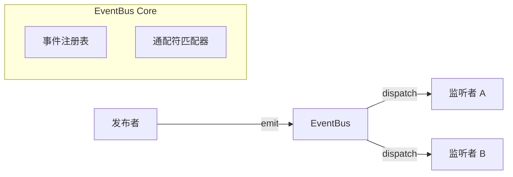

# 002 事件系统设计 (Event System)

*   **Status**: Draft
*   **Author**: Core Team
*   **Created**: 2026-02-09

## 1. 背景与目标

### 1.1 背景
编辑器涉及大量模块间的通信（Core, Designer, Renderer, Plugins）。直接的函数调用会导致模块强耦合，难以扩展。我们需要一个中心化的事件总线来解耦。

### 1.2 目标
*   实现一个高性能的 **EventBus**。
*   支持 **通配符监听** (e.g., `node:*`)，方便插件开发。
*   支持 **命名空间**，防止事件冲突。
*   提供 TypeScript 类型支持，确保事件参数的安全性。

## 2. 详细设计

### 2.1 架构设计



### 2.2 事件命名规范
采用 `Resource:Action` 的格式，全部小写。

*   `engine:init`
*   `engine:mount`
*   `node:add`
*   `node:remove`
*   `node:change`
*   `selection:change`
*   `history:undo`
*   `history:redo`

### 2.3 接口定义

```typescript
type EventHandler<T = any> = (event: T) => void;

interface IEventBus {
    // 监听事件
    on<T>(event: string, handler: EventHandler<T>): () => void;
    
    // 监听一次
    once<T>(event: string, handler: EventHandler<T>): void;
    
    // 取消监听
    off(event: string, handler: EventHandler): void;
    
    // 发射事件
    emit(event: string, payload?: any): void;
}
```

### 2.4 通配符支持
*   `*`: 匹配一级。如 `node:*` 匹配 `node:add`, `node:remove`。
*   `**`: 匹配多级（可选）。

为了性能考虑，建议初期仅支持后缀通配符（`prefix:*`）。

## 3. 核心流程

### 事件派发流程
1.  模块 A 调用 `emit('node:change', { id: 1 })`。
2.  EventBus 查找精确匹配 `node:change` 的监听器列表。
3.  EventBus 查找通配符匹配 `node:*` 的监听器列表。
4.  依次同步执行监听器回调。
5.  如果任一监听器抛出异常，EventBus 捕获并记录 Error Log，**不阻断后续监听器执行**。

## 4. API 设计

```javascript
// 1. 普通监听
engine.events.on('node:add', ({ node }) => {
    console.log('Added:', node.id);
});

// 2. 通配符监听
engine.events.on('node:*', (payload) => {
    console.log('Node operation:', payload);
});

// 3. 插件中的使用
const myPlugin = (ctx) => {
    // 自动清理：当插件销毁时，该监听器会自动移除（需 PluginManager 支持）
    ctx.events.on('history:undo', () => {
        // ...
    });
};
```

## 5. 性能与边界

*   **同步 vs 异步**: 核心事件（如数据变更）必须是**同步**的，以保证 UI 渲染的一致性。部分非关键事件（如埋点上报）可以是异步的。
*   **循环调用**: 需要防范 `A -> emit -> B -> emit -> A` 的死循环。可以通过 `Transaction` 锁或调用栈深度限制来解决。

## 6. 测试计划
*   测试通配符匹配逻辑的正确性。
*   测试 `off` 方法是否能干净地移除监听器（避免内存泄漏）。
*   测试异常捕获机制。
