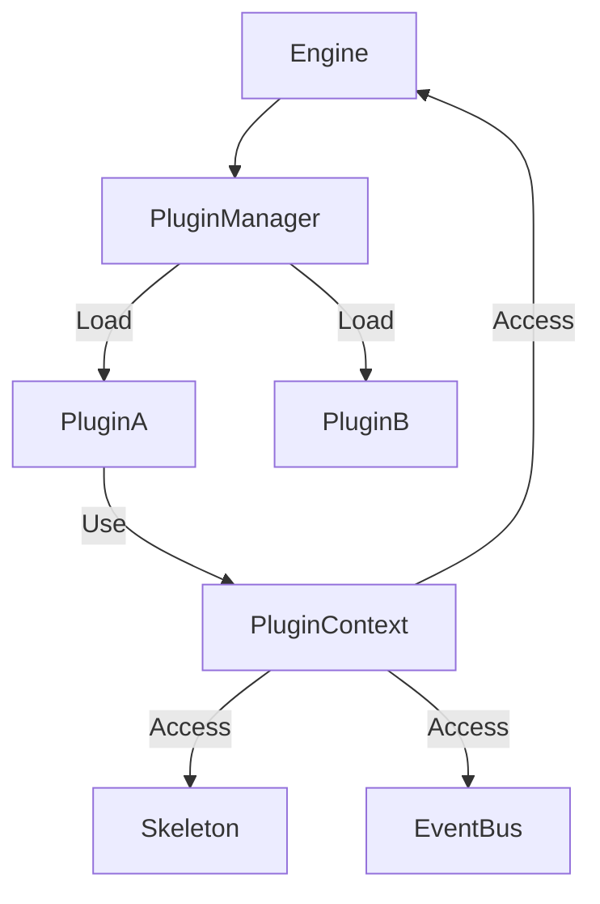

# 003 插件架构设计 (Plugin Architecture)

*   **Status**: Draft
*   **Author**: Core Team
*   **Created**: 2026-02-09

## 1. 背景与目标

### 1.1 背景
低代码编辑器的核心能力应当保持精简，而大量的业务功能（如快捷键、右键菜单、特定面板、历史记录）应通过插件实现。我们需要一个灵活且安全的插件架构来支撑生态扩展。

### 1.2 目标
*   定义标准的插件接口与生命周期。
*   提供丰富的 **Extension Points (扩展点)**，允许插件侵入编辑器的各个环节（初始化、渲染、交互）。
*   实现插件之间的依赖管理与通信。
*   (可选) 提供沙箱隔离机制，防止插件崩溃影响主程序。

## 2. 详细设计

### 2.1 核心概念

*   **Plugin**: 一个独立的逻辑单元，通常包含 `init` 和 `destroy` 方法。
*   **PluginManager**: 负责插件的加载、初始化、卸载及依赖解析。
*   **PluginContext (Ctx)**: 插件运行时上下文，暴露给插件的受限 API 集合。
*   **Skeleton**: UI 骨架模型，插件通过它在界面上注册按钮、面板等区域。

### 2.2 架构设计



### 2.3 插件接口定义

```typescript
interface PluginFactory {
  (ctx: PluginContext, options: any): PluginInstance;
}

interface PluginInstance {
  name: string;
  init(): void | Promise<void>;
  destroy(): void;
  exports?: any; // 暴露给其他插件调用的 API
}

interface PluginContext {
  engine: Engine;
  events: EventBus;
  skeleton: Skeleton;
  hotkey: HotkeyManager;
  // ...更多能力
}
```

### 2.4 扩展点 (Extension Points)

插件可以通过 Context 访问以下能力：

1.  **UI 扩展**: 在 TopBar, SideBar, StatusBar 注册组件。
    *   `ctx.skeleton.add({ area: 'topbar', content: MyButton })`
2.  **事件监听**: 响应内核事件。
    *   `ctx.events.on('node:add', ...)`
3.  **交互拦截**: 注册自定义的 Interaction Handler。
    *   `ctx.canvas.registerHandler(...)`
4.  **快捷键**: 
    *   `ctx.hotkey.bind('ctrl+z', ...)`

## 3. 核心流程

### 2.5 插件模式 (Plugin Patterns)

根据工作方式的不同，插件主要分为三种模式：

1.  **自动启动型 (Auto-start / Eager)**
    *   **特点**: 加载即运行，无需外部调用。在 `init()` 中完成所有的副作用绑定。
    *   **典型行为**: 注册 UI 组件、监听全局事件、拦截交互、绑定快捷键。
    *   **场景**: 
        *   `StatusbarPlugin`: 自动在底部状态栏渲染信息。
        *   `AutosavePlugin`: 监听 `history:change` 自动保存。
        *   `KeyboardPlugin`: 绑定快捷键。

2.  **API 驱动型 (API-driven / Lazy)**
    *   **特点**: 加载后处于静默状态，仅暴露 API 供其他模块调用。
    *   **典型行为**: `init()` 仅做基础服务初始化，核心功能通过 `exports` 暴露。
    *   **场景**:
        *   `ToastPlugin`: 暴露 `toast.success()` 方法。
        *   `DialogPlugin`: 暴露 `dialog.confirm()` 方法。
        *   `ExporterPlugin`: 暴露 `exportToPDF()` 方法。

3.  **混合型 (Hybrid)**
    *   **特点**: 既有自动运行的逻辑，也提供 API 控制。
    *   **场景**: `HistoryPlugin`（自动记录变更 + 暴露 Undo/Redo/Clear API）。

### 插件加载流程
1.  用户配置 `plugins: [PluginA, [PluginB, { option: 1 }]]`。
2.  `Engine.init()` 启动 `PluginManager`。
3.  `PluginManager` 遍历插件列表，创建 `PluginContext`。
4.  依次调用插件的 `init()` 方法。
    *   **注意**: 若插件有异步初始化，需 `await` 确保顺序。
5.  所有插件初始化完成后，Engine 发射 `engine:ready` 事件。

### 插件通信
插件 A 可以调用插件 B 暴露的方法：
```javascript
// Plugin B
return {
    name: 'history',
    exports: { undo: () => { ... } }
}

// Plugin A
const history = ctx.plugins.get('history');
history.undo();
```

## 4. API 设计

### PluginManager API

```javascript
// 注册插件
manager.register(MyPlugin, { theme: 'dark' });

// 获取插件实例
const plugin = manager.get('my-plugin');

// 销毁插件
manager.dispose('my-plugin');
```

## 5. 安全性与隔离 (Security)

*   **API 管控**: 插件拿到的 `ctx` 是经过封装的代理对象，而非原始 Engine 实例，防止插件随意修改内核私有属性。
*   **错误边界**: 插件 `init` 或回调报错时，由 `PluginManager` 捕获，防止崩坏主线程。

## 6. 测试计划

*   **Unit Test**: 测试插件的加载顺序、依赖解析及销毁逻辑。
*   **Integration Test**: 编写一个 Mock 插件，验证其能否正确注册 UI 和监听事件。
