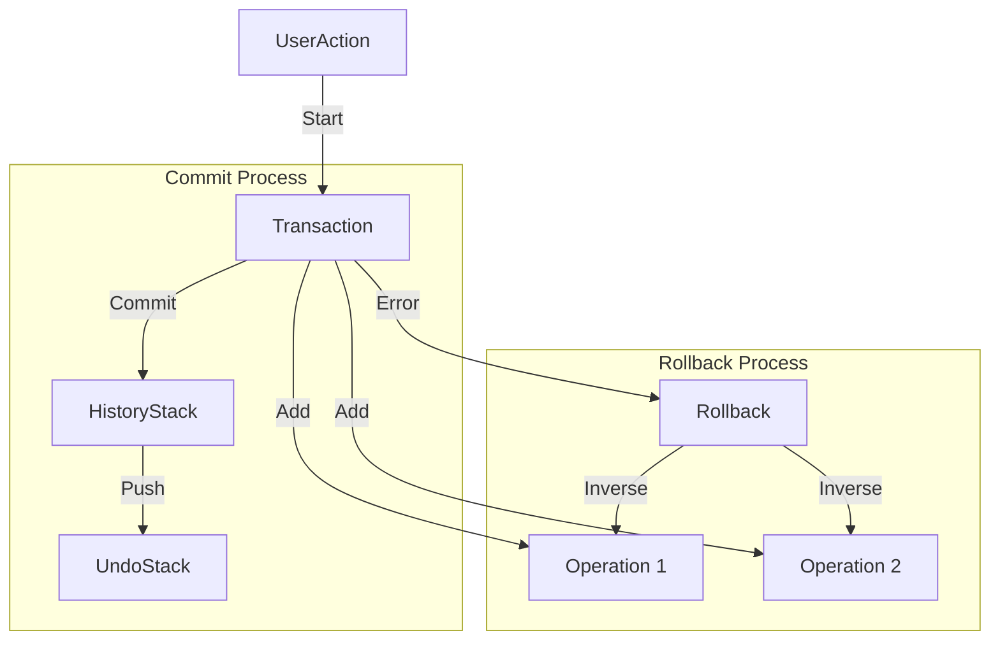

# 004 事务与历史记录设计 (Transaction & History)

*   **Status**: Draft
*   **Author**: Core Team
*   **Created**: 2026-02-09

## 1. 背景与目标

### 1.1 背景
低代码编辑器的用户操作通常是复杂的“多步原子操作”（例如拖拽包含：选中、移动、更新父节点、更新位置）。若中间失败，需整体回滚。同时，用户需要无限级的撤销/重做能力。

### 1.2 目标
*   实现 **Transaction (事务)** 机制，确保操作的原子性。
*   实现基于 **Command Pattern (命令模式)** 或 **Snapshot (快照)** 的历史记录。
*   支持 **Group Undo** (合并多次小操作为一次撤销)。
*   优化内存占用，避免全量存储快照。

## 2. 详细设计

### 2.1 核心概念

*   **Transaction**: 一组操作的集合，具有 ACID 特性（主要是 Atomicity 原子性）。
*   **Operation (Op)**: 最小粒度的修改指令，如 `setProp`, `moveNode`。
*   **HistoryStack**: 存储已提交事务的栈结构。
*   **Snapshot**: 文档在某时刻的完整状态副本。

### 2.2 架构设计



### 2.3 数据结构

#### Transaction Class
```typescript
class Transaction {
  id: string;
  ops: Operation[];
  status: 'pending' | 'committed' | 'rolled-back';
  
  // 提交：将自身推入历史栈
  commit(): void;
  
  // 回滚：执行 ops 的逆操作
  rollback(): void;
}
```

#### Operation Interface
采用 **JSON Patch** 或 **Inverse Function** 风格：

```typescript
interface Operation {
  type: 'setProp' | 'insertNode' | 'removeNode';
  targetId: string;
  payload: any;
  // 逆向操作数据（用于回滚）
  inverse?: any; 
}
```

由于我们使用 `Immer`，可以利用 `immer` 的 `patches` 和 `inversePatches` 特性自动生成 Op。

### 2.4 核心流程

#### 自动事务 (Auto Transaction)
若用户直接调用 `node.setProp` 而未显式开启事务，系统自动创建一个“单操作事务”并立即提交。

#### 显式事务 (Explicit Transaction)
```javascript
engine.transaction.start('drag-move');
try {
    nodeA.setProp('x', 100);
    nodeB.setProp('y', 200);
    engine.transaction.commit();
} catch (e) {
    engine.transaction.rollback();
}
```

#### 撤销/重做流程
1.  用户点击 Undo。
2.  HistoryManager 从 `UndoStack` 弹出最近一个 Transaction。
3.  遍历 Transaction 中的 `ops`（倒序）。
4.  对每个 op 执行逆向操作（apply inverse patch）。
5.  将该 Transaction 推入 `RedoStack`。
6.  触发 `history:change` 事件。

## 3. 性能优化

### 快照压缩
不存储每次的全量 JSON。仅存储 `Initial State` + `Patches`。
当 Patches 数量超过阈值（如 50）时，生成一个新的 Baseline Snapshot，丢弃旧的 Patches（或者归档）。

### 节流 (Throttling)
对于高频操作（如 `mousemove` 触发的 `setProp`），不应产生成百上千个历史记录。
**策略**:
1.  在 `drag` 过程中不提交事务，只更新视图。
2.  在 `dragEnd` 时提交一次最终事务。

## 4. API 设计

```javascript
// 开启事务
const tx = engine.transaction.start('update-layout');

// 提交
tx.commit();

// 历史操作
engine.history.undo();
engine.history.redo();
engine.history.clear();

// 跳转到指定快照
engine.history.goto(stateIndex);
```

## 5. 测试计划

*   **Unit Test**:
    *   测试事务回滚是否能精确还原状态。
    *   测试嵌套事务的处理（当前设计不支持嵌套，需报错或扁平化）。
    *   测试 Undo/Redo 后，再次写入操作是否正确清空 RedoStack。
*   **Fuzz Testing**: 随机生成大量操作序列，验证最终状态的一致性。
