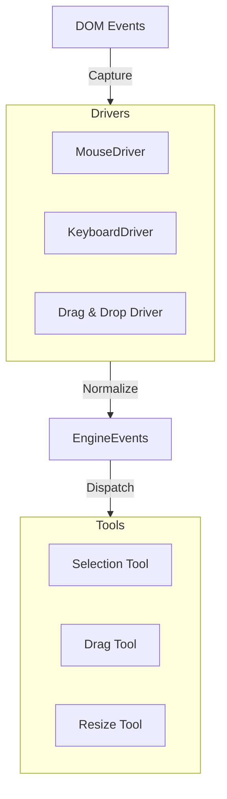

# 005 交互驱动设计 (Interaction Drivers)

*   **Status**: Draft
*   **Author**: Core Team
*   **Created**: 2026-02-09

## 1. 背景与目标

### 1.1 背景
编辑器中充满了复杂的交互，如拖拽组件、调整大小、框选节点等。这些交互逻辑如果分散在各个 UI 组件中，会导致代码难以维护且难以复用（例如 Canvas 和 Outline 树都需要拖拽逻辑）。

### 1.2 目标
*   将 DOM 事件（MouseDown/Move/Up）转化为语义化的 **Editor Events**（DragStart/Dragging/Drop）。
*   实现 **Driver (驱动)** 层，屏蔽浏览器差异，统一输入源。
*   实现 **Interaction State Machine (交互状态机)**，管理当前的交互模式（如：选择模式、拖拽模式）。

## 2. 详细设计

### 2.1 架构设计



### 2.2 核心驱动 (Core Drivers)

#### MouseDriver
监听全局或画布区域的鼠标事件，计算：
*   `cursor`: 当前鼠标位置 (ClientX, ClientY)。
*   `delta`: 移动距离。
*   `target`: 当前 hover 的节点 ID。

#### KeyboardDriver
监听全局键盘事件，处理快捷键组合。
*   支持 `Command+S`, `Ctrl+C` 等组合键识别。
*   支持优先级抢占（Input 框聚焦时屏蔽快捷键）。

#### DragDropDriver
基于 MouseDriver 封装的高级驱动。
*   **状态机**: `Idle` -> `DragStart` (阈值检测) -> `Dragging` -> `Drop` -> `Idle`。
*   **Ghost**: 负责在拖拽过程中渲染“幽灵”节点。

### 2.3 交互状态机 (Interaction State Machine)

编辑器在任一时刻只能处于一种主要交互模式，以避免冲突（例如：正在框选时不能拖拽）。

*   **Default**: 默认模式，响应 Hover、Click。
*   **Dragging**: 拖拽模式，屏蔽 Hover 效果，高亮 DropZone。
*   **Resizing**: 缩放模式，锁定选中节点。
*   **Panning**: 画布漫游模式（按住 Space）。

## 3. 核心流程

### 3.1 拖拽策略 (Drag Policies)

不同的业务场景对应不同的拖拽策略。

#### A. 画布内拖拽 (Sort/Move)
*   **场景**: 在同一容器内调整位置（流式排序或自由移动）。
*   **流程**:
    1.  `DragStart`: 记录 `sourceIndex`。
    2.  `DragOver`: 实时计算鼠标相对于兄弟节点的位置。
    3.  **Sortable Flow**: 若鼠标越过节点中线，交换占位符位置。
    4.  **Free Move**: 直接更新占位符的 `x, y`。
    5.  `Drop`: 提交 `moveNode(sourceId, targetIndex)`。

#### B. 跨容器拖拽 (Cross-Container)
*   **场景**: 将组件从容器 A 拖入容器 B。
*   **流程**:
    1.  `DragStart`: 记录 `sourceParent`。
    2.  `DragEnter`: 鼠标进入新容器，触发 `container.highlight()`。
    3.  **Insertion Calculation**: 根据容器布局策略（Flow/Grid）计算插入点。
    4.  `Drop`: 
        *   事务操作：`sourceParent.removeChild(node)` -> `targetParent.insertChild(node, index)`。

#### C. 从物料堆拖入 (Insert from Material)
*   **场景**: 从左侧组件库拖入画布。
*   **流程**:
    1.  `DragStart`: 携带物料元数据 (Schema)。
    2.  `DragOver`: 画布渲染一个临时的 `Ghost Node`（半透明）。
    3.  `Drop`: 
        *   根据 Schema 创建新 `Node` 实例。
        *   执行 `targetParent.insertChild(newNode, index)`。

### 3.2 占位符机制 (Placeholder)

在拖拽过程中，**不直接修改 DOM 树结构**，而是使用视觉占位符。

*   **Line Placeholder**: 是一条线（用于 Flow 布局），指示插入缝隙。
*   **Box Placeholder**: 是一个虚线框（用于 Grid/Free 布局），指示占据的空间。

### 3.3 拖拽流程 (Drag Flow Summary)

1.  **MouseDown**: MouseDriver 记录起始点，Target 指向某个 Node。
2.  **MouseMove**: 
    *   计算位移 `delta`。
    *   若 `delta > 3px`，触发 `DragDropDriver.start()`。
    *   进入 `Dragging` 状态。
    *   `DragTool` 接管，计算当前鼠标下的 DropContainer 和 InsertionIndex。
    *   Core 模型层创建/更新 `Placeholder` 节点。
3.  **MouseUp**:
    *   触发 `DragDropDriver.drop()`。
    *   `DragTool` 将 `Placeholder` 替换为真实节点（Move 或 Insert 操作）。
    *   提交 Transaction。
    *   恢复 `Default` 状态。

## 4. API 设计

```javascript
// 注册自定义交互工具
engine.interaction.use(new MyCustomTool());

// 监听交互事件
engine.drivers.dnd.on('dragStart', (e) => {
    console.log('Start dragging:', e.sourceNode);
});

// 强制切换模式
engine.interaction.setMode('panning');
```

## 5. 测试计划

*   **E2E Test**: 这是交互模块测试的重点。使用 Cypress 模拟真实的鼠标拖拽轨迹，验证节点是否正确落入目标容器。
*   **Unit Test**: 测试快捷键匹配算法；测试状态机的状态流转逻辑。
