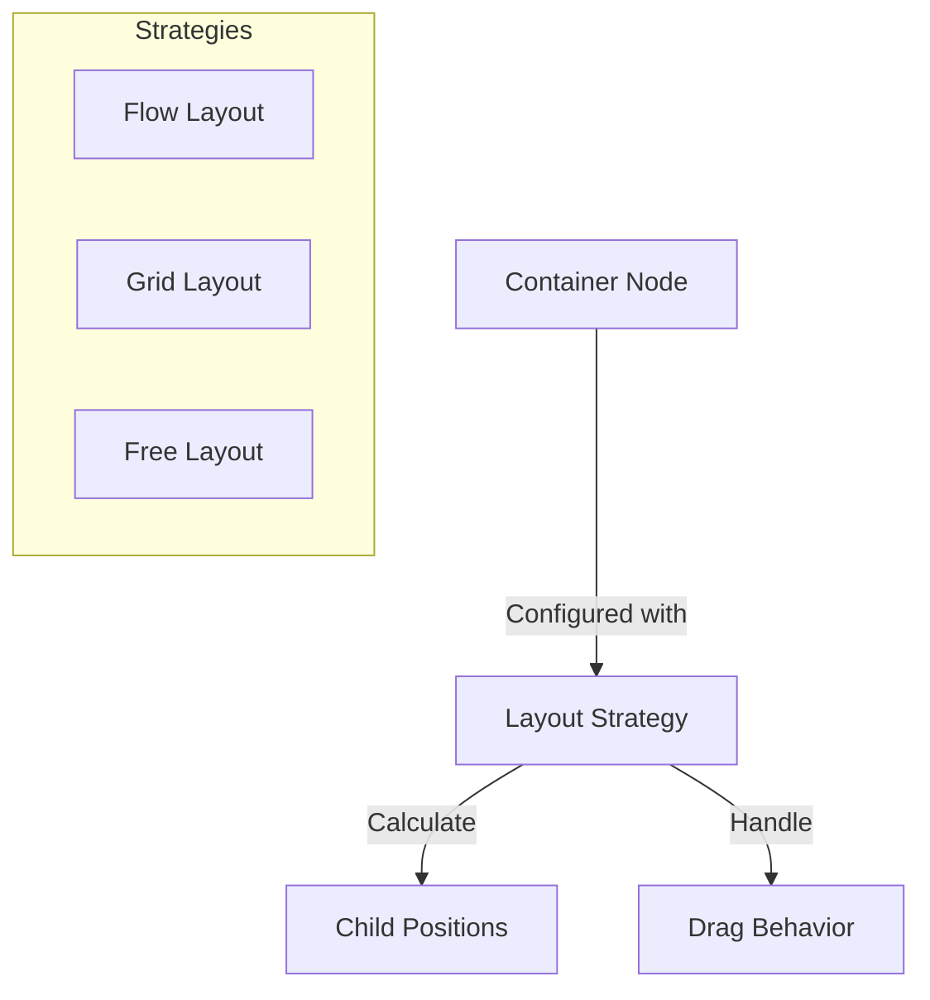
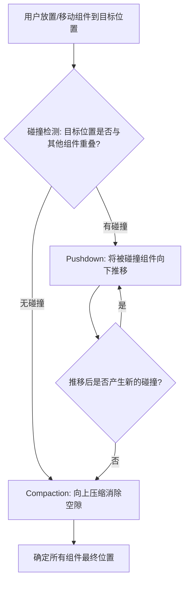

# 006 布局系统设计 (Layout System)

*   **Status**: Draft
*   **Author**: Core Team
*   **Created**: 2026-02-09

## 1. 背景与目标

### 1.1 背景
低代码编辑器需要支持多种复杂的布局模式。不同的业务场景对布局有不同的要求：表单页面通常使用流式布局，营销落地页通常使用自由布局，而数据大屏可能需要网格布局。核心库必须提供一套可扩展的布局引擎来支撑这些需求。

### 1.2 目标
*   定义标准的布局策略接口 (`LayoutStrategy`)。
*   实现核心布局模式：**Flow (流式)**、**Grid (网格)**、**Free (自由/绝对定位)**。
*   支持布局嵌套（例如：Grid 布局的单元格内可以使用 Flow 布局）。
*   解耦布局逻辑与渲染逻辑。

## 2. 详细设计

### 2.1 架构设计

布局引擎采用 **策略模式 (Strategy Pattern)**。每个容器节点 (`Container Node`) 都可以配置自己的布局策略。



### 2.2 布局策略接口

```typescript
interface LayoutStrategy {
  name: string; // 'flow' | 'grid' | 'free'
  
  /**
   * 当前模式下是否允许用户拖拽
   * @param mode 当前模式 ('edit' | 'runtime')
   * @returns 是否启用拖拽交互
   */
  isDraggable(mode: 'edit' | 'runtime'): boolean;
  
  /**
   * 拖拽进入时的位置计算
   * @param container 容器节点
   * @param dragNode 拖拽节点
   * @param cursor 鼠标位置 {x, y}
   * @returns 插入索引或坐标
   */
  getDropPosition(container: Node, dragNode: Node, cursor: Point): DropPosition;
  
  /**
   * 渲染时的样式生成
   * @param node 子节点
   * @returns CSS 样式对象
   */
  getNodeStyle(node: Node): CSSProperties;
}
```

### 2.3 核心布局模式

#### 1. 流式布局 (Flow Layout)
最常见的布局模式，遵循 Web 文档流。
*   **行为**: 
    *   子节点按顺序排列（从左到右，从上到下）。
    *   拖拽时，计算鼠标位置在哪个子节点的前后（Insertion Index）。
    *   通常用于：表单、列表、文章排版。
*   **实现**: 基于 CSS Flexbox 或 Block 布局。

#### 2. 网格布局 (Grid Layout)
基于栅格系统的布局，支持编辑态和运行态双向拖拽。

*   **行为**:
    *   容器被划分为 N 列（如 12 列或 24 列）。
    *   子节点占据 x, y, w, h 四个属性（以栅格单位计量）。
    *   拖拽时，吸附到最近的网格线。
    *   通常用于：Dashboard、数据大屏。
*   **实现**: 基于 CSS Grid 或 React-Grid-Layout 算法。

##### 栅格配置模型 (Grid Config)

```typescript
interface GridConfig {
  colCount: number;     // 列数，如 12 或 24
  rowHeight: number;    // 单行高度 (px)，如 30
  gap: [number, number]; // 栅格间距 [水平px, 垂直px]，如 [10, 10]
  margin: [number, number]; // 容器内边距 [水平px, 垂直px]，如 [10, 10]
}
```

每个子节点在 Grid 中的位置由 **栅格坐标** 描述：

```typescript
interface GridItemLayout {
  x: number;  // 列起始位置 (0-indexed)
  y: number;  // 行起始位置 (0-indexed)
  w: number;  // 占据列数 (min: 1)
  h: number;  // 占据行数 (min: 1)
  minW?: number; // 最小宽度 (栅格单位)
  minH?: number; // 最小高度 (栅格单位)
}
```

##### 吸附逻辑 (Snap-to-Grid)

拖拽移动和 Resize 时，像素坐标需折算为栅格坐标并取整：

```
cellWidth = (containerWidth - margin[0] * 2 - gap[0] * (colCount - 1)) / colCount
snapX = Math.round((cursorX - margin[0]) / (cellWidth + gap[0]))
snapY = Math.round((cursorY - margin[1]) / (rowHeight + gap[1]))
```

视觉上表现为"按格跳动"，而非像素级平滑移动。

#### 3. 自由布局 (Free Layout)
绝对定位布局。
*   **行为**:
    *   子节点拥有绝对坐标 (x, y) 和尺寸 (w, h)。
    *   拖拽时，自由移动，无吸附（除非开启辅助线）。
    *   通常用于：营销海报、PPT 制作。
*   **实现**: `position: absolute`。

### 2.4 布局嵌套

布局属性通常定义在容器节点的 `props.style` 或 `meta.layout` 中。
*   Root (Flow)
    *   Section (Grid)
        *   Card (Flow)
            *   Button
        *   Card (Flow)

渲染器递归时，会根据当前节点的布局配置，加载对应的 `LayoutStrategy` 来处理子节点的渲染和交互。

### 2.5 编辑态与运行态的布局行为

不同布局模式在 **编辑态 (Edit Mode)** 和 **运行态 (Runtime Mode)** 下的拖拽行为有显著差异：

| 布局模式 | 编辑态 (Edit) | 运行态 (Runtime) | 设计动机 |
| :--- | :--- | :--- | :--- |
| **Flow (流式)** | ✅ 可拖拽排序 / 跨容器移动 | ❌ 不可拖拽，按文档流静态渲染 | 流式布局是开发者预设的排版，终端用户无需调整 |
| **Free (自由)** | ✅ 可自由拖拽移动 / Resize | ❌ 不可拖拽，按绝对坐标静态渲染 | 自由布局的定位由设计者决定，运行时固定 |
| **Grid (网格)** | ✅ 可拖拽，按栅格吸附 | ✅ 可拖拽，按栅格吸附 | Dashboard 等场景需要终端用户自行编排卡片 |

> [!IMPORTANT]
> Grid 布局在运行态保留拖拽能力是核心设计决策。这使得 Dashboard 类产品的终端用户可以自由调整面板布局，调整后的布局应持久化到用户维度的配置中。

布局策略根据 `mode` 参数决定是否启用交互：

```typescript
class FlowLayout implements LayoutStrategy {
  isDraggable(mode: 'edit' | 'runtime'): boolean {
    return mode === 'edit'; // 仅编辑态可拖拽
  }
}

class GridLayout implements LayoutStrategy {
  isDraggable(mode: 'edit' | 'runtime'): boolean {
    return true; // 编辑态和运行态均可拖拽
  }
}

class FreeLayout implements LayoutStrategy {
  isDraggable(mode: 'edit' | 'runtime'): boolean {
    return mode === 'edit'; // 仅编辑态可拖拽
  }
}
```

### 2.6 Grid 挤压算法 (Compaction & Collision)

Grid 布局中，当组件被放置或移动时，可能与已有组件发生重叠。系统需通过 **碰撞检测 + 下推 + 压缩** 三步算法确定所有组件的最终位置。

#### 算法流程



#### Step 1: 碰撞检测 (Collision Detection)

判断两个 Grid Item 是否重叠：

```typescript
function isColliding(a: GridItemLayout, b: GridItemLayout): boolean {
  // 任一方向无交集则不碰撞
  if (a.x + a.w <= b.x) return false; // a 在 b 左侧
  if (a.x >= b.x + b.w) return false; // a 在 b 右侧
  if (a.y + a.h <= b.y) return false; // a 在 b 上方
  if (a.y >= b.y + b.h) return false; // a 在 b 下方
  return true;
}
```

#### Step 2: 下推 (Pushdown)

当组件 A 移动后与组件 B 碰撞，将 B 向下推移至 A 的正下方，并递归处理 B 推移后产生的新碰撞：

```typescript
function resolveCollisions(movedItem: GridItemLayout, allItems: GridItemLayout[]): void {
  for (const item of allItems) {
    if (item === movedItem) continue;
    if (isColliding(movedItem, item)) {
      // 将碰撞组件下推到 movedItem 下方
      item.y = movedItem.y + movedItem.h;
      // 递归处理被推移组件的新碰撞
      resolveCollisions(item, allItems);
    }
  }
}
```

#### Step 3: 向上压缩 (Compact Up)

碰撞解决后，所有组件可能存在不必要的空隙。从上到下遍历所有组件，逐个尝试向上移动到最高可用位置：

```typescript
function compactUp(allItems: GridItemLayout[]): void {
  // 按 y 坐标排序，从上到下处理
  allItems.sort((a, b) => a.y - b.y);
  
  for (const item of allItems) {
    // 不断尝试上移，直到碰到顶部或其他组件
    while (item.y > 0) {
      item.y -= 1;
      const hasCollision = allItems.some(
        other => other !== item && isColliding(item, other)
      );
      if (hasCollision) {
        item.y += 1; // 回退
        break;
      }
    }
  }
}
```

> [!NOTE]
> 压缩方向可扩展为"向左压缩"或"无压缩"模式，通过 `GridConfig.compactMode: 'vertical' | 'horizontal' | 'none'` 配置。

## 3. 核心流程

### 拖拽时的布局计算
1.  **DragEnter**: 鼠标进入容器。
2.  **Check Draggable**: 调用 `strategy.isDraggable(mode)`，若返回 `false` 则忽略拖拽。
3.  **Identify Strategy**: 获取容器的布局策略（如 Grid）。
4.  **Calculate Placeholder**: 调用 `strategy.getDropPosition`。
    *   如果是 Flow，返回 `{ index: 2 }`（插在第 2 个元素后）。
    *   如果是 Grid，返回 `{ x: 0, y: 4, w: 2, h: 2 }`（吸附后的网格坐标）。
5.  **Collision Resolve** *(仅 Grid)*: 调用挤压算法，计算所有组件的最终位置。
6.  **Render Ghost**: 在计算出的位置渲染占位符。

## 4. API 设计

```javascript
// 注册自定义布局
engine.layout.register('custom-circle', new CircleLayoutStrategy());

// 容器配置 Grid 布局
containerNode.setProp('layout', 'grid');
containerNode.setProp('gridConfig', {
  colCount: 12,
  rowHeight: 30,
  gap: [10, 10],
  margin: [10, 10],
  compactMode: 'vertical',
});
```

## 5. 测试计划

*   **Unit Test**: 
    *   针对每种策略，输入一组坐标，验证 `getDropPosition` 返回的索引/坐标是否符合预期。
    *   验证 `isDraggable` 在不同 mode 下返回正确的值。
    *   Grid 碰撞检测：验证重叠/不重叠的边界情况。
    *   Grid 下推算法：验证多层级级联碰撞的正确性。
    *   Grid 压缩算法：验证空隙消除后无悬浮组件。
*   **Integration Test**: 测试布局嵌套场景下的拖拽，确保事件冒泡和坐标转换正确（如从 Grid 拖入内部的 Flow 容器）。
*   **Performance Test**: 在 100+ 组件的 Grid 容器中拖拽移动，验证挤压算法耗时（目标 < 10ms）。
