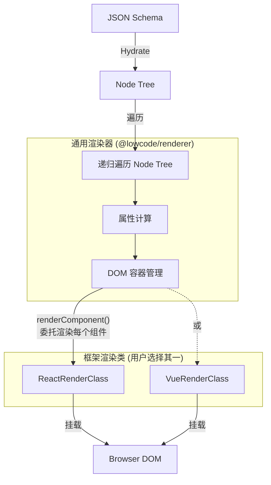

# 007 视图渲染机制 (View Renderer)

*   **Status**: Draft
*   **Author**: Core Team
*   **Created**: 2026-02-09
*   **Updated**: 2026-02-21

## 1. 背景与目标

### 1.1 背景

JSON Schema 和 Node Tree 是纯数据，用户最终看到的是 UI 界面。渲染层的职责是将这些数据高效、准确地转换为 DOM。

渲染层采用**通用渲染器 + 框架渲染类**的分层架构：
- **通用渲染器 (Universal Renderer)**: 位于 `@lowcode/renderer`，是框架无关的纯 JavaScript 实现。负责递归遍历 Node Tree、计算属性、处理条件/循环渲染、管理 DOM 容器。
- **框架渲染类 (Framework Render Class)**: 由各适配器包（如 `@lowcode/renderer-react`）提供，只实现单个组件的挂载逻辑——即如何用特定框架（React / Vue）把一个组件渲染到给定的 DOM 容器中。

### 1.2 目标

*   定义 **Schema Hydration (注水)** 流程：如何将 JSON 加载为 Node Tree。
*   实现 **Universal Renderer (通用渲染器)**：递归遍历 Node Tree，委托框架渲染类挂载每个组件。
*   定义 **FrameworkRenderClass 接口**：各框架适配器需实现的统一接口。
*   实现 **Component Loader (组件加载器)**：动态加载业务组件。
*   优化 **Update Performance**：实现精准更新，避免牵一发而动全身。

## 2. 详细设计

### 2.1 架构设计



### 2.2 Schema Hydration (注水流程)

这是"JSON Schema 渲染成树"的第一步，发生在 `engine.workspace.open(schema)` 阶段（在 Model 层完成，与渲染器无关）。

1.  **Traversal**: 深度优先遍历 JSON Schema。
2.  **Instantiation**: 为每个节点创建 `Node` 实例。
    *   生成唯一 `id`（如果 Schema 中没有）。
    *   建立 `parent` 指针。
    *   初始化 `_runtime` 状态。
3.  **Indexing**: 将所有节点存入 `doc.nodes` Map，方便 O(1) 查找。

### 2.3 框架渲染类接口 (FrameworkRenderClass)

所有框架渲染类必须实现统一接口。核心职责只有一个：**将单个组件挂载到指定的 DOM 容器**。

```typescript
interface RenderComponentOptions {
    componentName: string;       // 组件名称
    props: Record<string, any>; // 已解析的属性
    container: HTMLElement;      // 挂载目标 DOM 容器
    node: Node;                  // 当前节点实例
    mode: 'edit' | 'runtime';   // 渲染模式
}

interface FrameworkRenderClass {
    /** 将一个组件渲染/挂载到指定的 DOM 容器中 */
    renderComponent(options: RenderComponentOptions): void;
    
    /** 更新已挂载组件的属性 */
    updateComponent(nodeId: string, props: Record<string, any>): void;
    
    /** 销毁已挂载的单个组件，清理资源 */
    destroyComponent(nodeId: string): void;
    
    /** 注册业务组件 */
    registerComponent(name: string, component: any): void;
    
    /** 获取已注册的业务组件 */
    getComponent(name: string): any | undefined;
}
```

### 2.4 通用渲染器递归渲染流程

通用渲染器的核心逻辑由纯 JavaScript 实现，框架无关。它递归遍历 Node Tree，对每个节点：

1. 计算属性（解析 `JSExpression` 等动态值）
2. 创建 DOM 容器 `<div data-node-id="...">`
3. 调用 `renderClass.renderComponent()` 将组件挂载到容器
4. 递归处理子节点

```javascript
/**
 * 通用渲染器核心逻辑 (纯 JS，框架无关)
 * 递归遍历节点树，委托框架渲染类渲染每个组件
 */
function renderNode(node, renderClass, mode) {
  // 1. 计算属性
  const resolvedProps = computeProps(node.props);
  
  // 2. 创建 DOM 容器
  const container = document.createElement('div');
  container.setAttribute('data-node-id', node.id);
  
  // 3. 委托框架渲染类挂载组件
  renderClass.renderComponent({
    componentName: node.componentName,
    props: resolvedProps,
    container,
    node,
    mode,
  });
  
  // 4. 递归渲染子节点
  (node.children || []).forEach(child => {
    const childEl = renderNode(child, renderClass, mode);
    container.appendChild(childEl);
  });
  
  return container;
}
```

各框架渲染类的 `renderComponent` 实现示例：

```javascript
// ---- React 框架渲染类 ----
class ReactRenderClass {
  renderComponent({ componentName, props, container, node, mode }) {
    const Comp = this.registry.get(componentName);
    const element = React.createElement(Comp, props);
    
    const wrapped = mode === 'edit'
      ? React.createElement(NodeWrapper, { node }, element)
      : element;
    
    ReactDOM.createRoot(container).render(wrapped);
  }
}

// ---- Vue 3 框架渲染类 ----
class VueRenderClass {
  renderComponent({ componentName, props, container, node, mode }) {
    const Comp = this.registry.get(componentName);
    const app = createApp(Comp, props);
    app.mount(container);
    this.instances.set(node.id, app);
  }
}
```

### 2.5 组件加载器 (Component Loader)

负责根据 `componentName` 找到具体的组件实现。通过框架渲染类的 `registerComponent` / `getComponent` 管理。

*   **Registry**: 维护 `Map<string, ComponentClass>`。
*   **Async Load**: 支持远程组件 (`import()`)。

```javascript
// 注册组件（组件实现需匹配所选框架渲染类）
engine.components.register('Button', MyButton);

// 渲染时查找（未找到则回退到默认占位符）
const Comp = engine.components.get('Button') || DefaultPlaceholder;
```

### 2.6 编辑态包装器 (NodeWrapper)

在编辑模式下，所有组件被包裹一层 `NodeWrapper`（由各框架渲染类各自实现）。

*   **职责**:
    *   **拦截交互**: 阻止业务组件内部的点击跳转（如 `<a>` 标签），改为"选中节点"。
    *   **注入事件**: 绑定 `onMouseDown`，触发 `DragStart`。
    *   **显示辅助**: 渲染 Hover 边框、Label 标签。
    *   **Ref 转发**: 获取真实 DOM 节点，用于计算尺寸和位置。

## 3. 性能优化

### 精准更新 (Fine-grained Update)

避免在 Root 层面监听所有变化导致全量重绘。**策略**: 每个渲染节点只订阅 **当前 Node** 的变化。

```javascript
// React 渲染类示例
const NodeRenderer = ({ nodeId }) => {
  const node = useNode(nodeId); // 只订阅当前节点的变更
  // ...
}
```

当 `node.setProp` 发生时，EventBus 触发 `node:change:${id}`，只有对应的渲染节点重绘。各框架渲染类利用框架自身的优化机制（React 的 `memo`、Vue 的响应式系统等）实现高效更新。

## 4. API 设计

```javascript
import { Engine } from '@lowcode/core';
import { ReactRenderClass } from '@lowcode/renderer-react';

const engine = new Engine({
    renderClass: new ReactRenderClass(),
});

// 渲染到 DOM
engine.render(document.getElementById('app'));

// 获取节点对应的 DOM
const dom = engine.renderer.getContainer(nodeId);
```

## 5. 测试计划

*   **Unit Test**: Mock `FrameworkRenderClass`，验证通用渲染器的递归逻辑、属性传递、DOM 容器创建。
*   **Integration Test**: 使用简单的 Schema，验证通过 Engine API 完整渲染流程。
*   **Performance Test**: 渲染 5000 个节点的树，测量首屏时间和更新时间。
