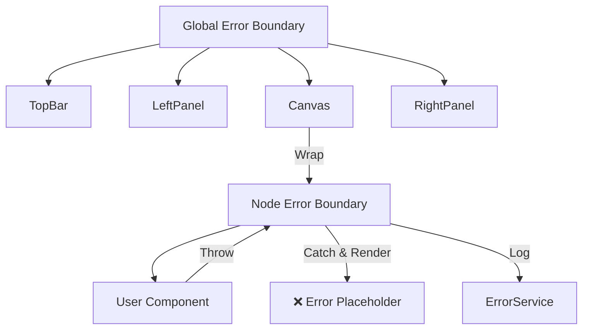

# 009 错误处理设计 (Error Handling Infrastructure)

*   **Status**: Draft
*   **Author**: Core Team
*   **Created**: 2026-02-13

## 1. 背景与目标

### 1.1 问题
编辑器作为复杂的 SPA，一旦某个组件运行崩溃（如 undefined 引用），往往会导致整个页面白屏。同时，用户在生产环境遇到的报错难以复现，缺乏上下文信息。

### 1.2 目标
*   **高可用**: 局部组件崩溃不影响编辑器整体运行（自动降级）。
*   **可追溯**: 自动收集错误堆栈、操作日志、环境信息并上报。
*   **可分类**: 区分系统错误（需修复）和用户错误（需提示）。

## 2. 详细设计

### 2.1 错误分类体系

我们需要定义标准的错误类型，以便于分层处理。

```typescript
// 错误基类
abstract class BaseError extends Error {
  constructor(
    public message: string,
    public code: string,
    public data?: any
  ) { super(message); }
}

// 1. 系统内核错误 (需上报 fix)
class CoreError extends BaseError {
  type = 'System'; // e.g. Node not found, Circular dependency
}

// 2. 插件/扩展错误 (需隔离 & 上报 plugin author)
class PluginError extends BaseError {
  type = 'Extension'; // e.g. Plugin init failed
}

// 3. 用户操作错误 (仅 Toast 提示)
class UserError extends BaseError {
  type = 'User'; // e.g. Invalid prop value, Permission denied
}

// 4. 渲染/视图错误 (需降级 UI)
class RenderError extends BaseError {
  type = 'View'; // e.g. Component render failed
}
```

### 2.2 错误边界 (Error Boundary)

即使做了严格的测试，组件渲染崩溃仍无法完全避免。我们在关键区域设置 React ErrorBoundary。

**设计原则**: 细粒度隔离。
*   **全局级**: 防止整个 App 挂掉。
*   **面板级**: 属性面板崩溃，不影响画布。
*   **组件级**: 某个 Button 组件渲染失败，只显示"组件错误"占位符，不影响其他组件。



### 2.3 错误处理流程

1.  **Capture**: `try-catch` (同步逻辑) 或 `ErrorBoundary` (渲染逻辑) 或 `window.onerror` (全局兜底)。
2.  **Enrich**: 附加当前上下文（操作栈、选中的节点 ID、React 版本、浏览器信息）。
3.  **Filter**: 过滤掉噪音（如 Script error, User Cancelled）。
4.  **Report**: 通过 `Logger` 的 Error Adapter 上报到远端。
5.  **Notify**: 对用户可见的错误（UserError / CoreError），通过 Toast 或弹窗提示。

### 2.4 API 设计

```typescript
// 统一抛出错误的工具
import { ErrorFactory } from '@lowcode/utils-error';

// 抛出用户错误 (自动 Toast)
throw ErrorFactory.createUserError('VAL_001', '属性值必须是数字');

// 抛出系统错误 (自动上报)
throw ErrorFactory.createCoreError('NODE_404', '节点 ID 不存在', { id: 'node-1' });
```

---

## 3. 错误上报数据结构

上报到监控平台的数据应包含：

```json
{
  "error": {
    "name": "CoreError",
    "message": "Node node-1 not found",
    "stack": "..."
  },
  "context": {
    "action": "setProp",
    "nodeId": "node-1",
    "project": "demo-project",
    "user": "uid-123"
  },
  "environment": {
    "os": "MacIntel",
    "browser": "Chrome 120.0",
    "viewport": "1920x1080"
  },
  "breadcrumbs": [
    // 最近的操作记录 (由 Logger 提供)
    {"level": "INFO", "msg": "Select node node-1", "time": 1700000001},
    {"level": "INFO", "msg": "Click setting panel", "time": 1700000005}
  ]
}
```
